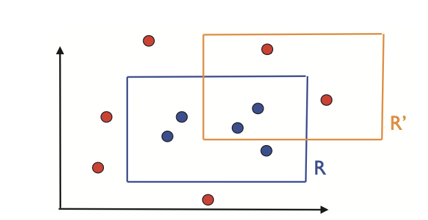
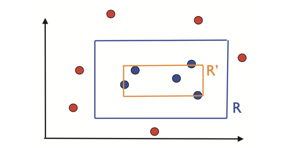

# Chapter 2: The PAC Learning Framework

## 2.1 The PAC learning model

!!! Definition "Definition 1: Generalization error"

    给定一个 hypothesis $h \in H$，一个 target concept $c \in C$，以及一个 underlying distribution $D$，$h$ 的 **generalization error** 或 **risk** 定义为：
    
    $$R(h) = \Pr_{x \sim D}[h(x) \neq c(x)] = \underset{x \sim D}{\mathbb{E}} \left[ \mathbf{1}_{h(x) \neq c(x)} \right] $$
    
    其中 $\mathbf{1}_\omega$ 是事件 $\omega$ 的 indicator function。

!!! Definition "Definition 2: Empirical error"

    给定一个 hypothesis $h \in H$，一个 target concept $c \in C$，以及一个样本 $S = (x_1, \ldots, x_m)$，$h$ 的 **empirical error** 或 **empirical risk** 定义为：
    
    $$\hat{R}(h) = \frac{1}{m} \sum_{i=1}^{m} \mathbf{1}_{h(x_i) \neq c(x_i)}$$

对于固定的 $h \in H$，基于 i.i.d. 样本 $S$ 的 empirical error 的期望等于 generalization error：

$$\mathbb{E}[\hat{R}(h)] = R(h)$$

!!! Info "Proof"

    因为期望线性性以及样本是 i.i.d. 抽取的，我们可以写出：

    $$\mathbb{E}_{S \sim D^m}[\hat{R}(h)] = \frac{1}{m} \sum_{i=1}^{m} \mathbb{E}_{S \sim D^m}[\mathbf{1}_{h(x_i) \neq c(x_i)}] = \frac{1}{m} \sum_{i=1}^{m} \mathbb{E}_{S \sim D^m}[\mathbf{1}_{h(x) \neq c(x)}]$$

    因此，

    $$\mathbb{E}_{S \sim D^m}[\hat{R}(h)] = \mathbb{E}_{S \sim D^m}[\mathbf{1}_{h(x) \neq c(x)}] = \mathbb{E}_{x \sim D}[\mathbf{1}_{h(x) \neq c(x)}] = R(h)$$

接下来将介绍 **Probably Approximately Correct (PAC)** 学习框架。定义 $O(n)$ 表示任何元素 $x \in \mathcal{X}$ 的计算成本的上界；$\text{size}(c)$ 表示 $c \in C$ 的计算成本的上界。

!!! Definition "Definition 3: PAC-learning"

    一个 concept class $C$ 被称为是 **PAC-learnable** 的，如果存在一个算法 $\mathcal{A}$ 和一个多项式函数 $\text{poly}(\cdot, \cdot, \cdot, \cdot)$，使得对于任意 $\epsilon > 0$ 和 $\delta > 0$，对于 $\mathcal{X}$ 上的所有分布 $D$ 和任意 target concept $c \in C$，对于任何样本大小 $m \geq \text{poly}(1/\epsilon, 1/\delta, n, \text{size}(c))$，以下条件成立：
    
    $$\Pr_{S \sim D^m}[R(h_S) \leq \epsilon] \geq 1 - \delta$$
    
    如果 $\mathcal{A}$ 进一步在 $\text{poly}(1/\epsilon, 1/\delta, n, \text{size}(c))$ 时间内运行，那么 $C$ 被称为是 **efficiently PAC-learnable** 的。当这样的算法 $\mathcal{A}$ 存在时，它被称为 $C$ 的 **PAC-learning algorithm**。

PAC 定义的几个关键点值得强调：首先，PAC 框架是一个 **distribution-free model**：对从中抽取 examples 的分布 $D$ 没有特定假设。其次，用于定义误差的 training sample 和 test examples 应该根据相同的分布 $D$ 抽取。最后，PAC 框架处理的是 concept **class** $C$ 的 **learnability** 问题，而不是特定 concept。注意 concept class $C$ 对算法是已知的，特定的 target concept $c \in C$ 是未知的。

在许多情况下，特别是当 concepts 的计算表示没有明确讨论时，我们可以省略 PAC 定义中对 $n$ 和 $\text{size}(c)$ 的多项式依赖，只关注 **sample complexity**。

## 2.2 Learning axis-aligned rectangles

假设实例集合是平面中的点，$\mathcal{X} = \mathbb{R}^2$，concept class $C$ 是位于 $\mathbb{R}^2$ 中的所有 **axis-aligned rectangles** 的集合。因此，每个 concept $c$ 是特定 axis-aligned rectangle 内部的点集合。

定义 Learning Problem: 使用 labeled training sample 以小误差确定 target axis-aligned rectangle。

*Figure 2.1: R 表示 target axis-aligned rectangle，R' 表示 hypothesis。蓝点表示在 target rectangle 内部，红点表示在 target rectangle 外部。*

为了证明这个 concept class 是 PAC-learnable 的，我们描述一个简单的 PAC-learning algorithm $\mathcal{A}$——给定一个 labeled sample $S$，该算法返回包含所有标记为 1 的点的最紧的 axis-aligned rectangle $R' = R_S$。

*Figure 2.2: 算法返回的 hypothesis $R' = R_S$ 的说明。*

设 $R \in C$ 是一个 target concept。固定 $\epsilon > 0$。设 $\Pr[R_S]$ 表示在 $D$ 中随机取点，点落在 $R_S$ 区域内的概率。由于我们算法产生的误差只能来自落在 $R_S$ 内的点，我们可以假设 $\Pr[R_S] > \epsilon$；否则，$R_S$ 的误差小于或等于 $\epsilon$，与接收到的 training sample $S$ 无关。

现在，由于 $\Pr[R_S] > \epsilon$，我们可以沿着 $R_S$ 的边定义四个矩形区域 $r_1, r_2, r_3$ 和 $r_4$，每个区域的概率至少为 $\epsilon/4$。这些区域可以通过从边上的空矩形开始并增加其大小直到其分布质量至少为 $\epsilon/4$ 来构造。

*Figure 2.3: 区域 $r_1, \ldots, r_4$ 的说明。*

观察到如果 $R_S$ 与所有这四个区域相交，那么，因为它是一个矩形，它将在这四个区域中的每一个都有一条边（几何论证）。它的误差区域，即它不覆盖的 R 的部分，因此包含在这些区域中，不能有超过 $\epsilon$ 的概率质量。相反，如果 $R(R_S) > \epsilon$，那么 $R_S$ 必须错过至少一个区域 $r_i, i \in [1, 4]$。因此，我们可以写出：

$$\Pr_{S \sim D^m}[R(R_S) > \epsilon] \leq \Pr_{S \sim D^m}[\bigcup_{i=1}^{4} \{R_S \cap r_i = \emptyset\}] \quad (2.5)$$

$$\leq \sum_{i=1}^{4} \Pr_{S \sim D^m}[\{R_S \cap r_i = \emptyset\}] \quad \text{(by the union bound)}$$

$$\leq 4(1 - \epsilon/4)^m \quad \text{(since } \Pr[r_i] > \epsilon/4\text{)}$$

$$\leq 4 \exp(-m\epsilon/4)$$

其中最后一步我们使用了对所有 $x \in \mathbb{R}$ 有效的一般恒等式 $1 - x \leq e^{-x}$。对于任何 $\delta > 0$，为了确保 $\Pr_{S \sim D^m}[R(R_S) > \epsilon] \leq \delta$，我们可以施加：

$$4 \exp(-\epsilon m/4) \leq \delta \Leftrightarrow m \geq \frac{4}{\epsilon} \log \frac{4}{\delta} \quad (2.6)$$

因此，对于任何 $\epsilon > 0$ 和 $\delta > 0$，如果样本大小 $m$ 大于 $\frac{4}{\epsilon} \log \frac{4}{\delta}$，那么 $\Pr_{S \sim D^m}[R(R_S) > \epsilon] \leq 1 - \delta$。此外，$\mathbb{R}^2$ 中点和 axis-aligned rectangles 的计算表示成本是常数。这证明了 axis-aligned rectangles 的 concept class 是 PAC-learnable 的，PAC-learning axis-aligned rectangles 的 sample complexity 为 $O(\frac{1}{\epsilon} \log \frac{1}{\delta})$。

呈现像 (2.6) 这样的 sample complexity 结果的等价方法（我们在本书中经常看到）是给出 **generalization bound**。它表明在概率至少 $1 - \delta$ 下，$R(R_S)$ 被某个依赖于样本大小 $m$ 和 $\delta$ 的量上界。为了得到这个，如果将 $\delta$ 设置为等于 (2.5) 中导出的上界，即 $\delta = 4 \exp(-m\epsilon/4)$ 并求解 $\epsilon$，得出在概率至少 $1 - \delta$ 下，算法的误差界为：

$$R(R_S) \leq \frac{4}{m} \log \frac{4}{\delta} \quad (2.7)$$

对于这个例子，可以考虑其他 PAC-learning algorithms。例如，一个替代方案是返回不包含 negative points 的最大 axis-aligned rectangle。刚刚为最紧 axis-aligned rectangle 呈现的 PAC-learning 证明可以很容易地适应其他此类算法的分析。

注意我们在此例子中考虑的 hypothesis set $H$ 与 concept class $C$ 重合，其基数是无限的。尽管如此，该问题允许简单的 PAC-learning 证明。我们可能会问，是否类似的证明可以很容易地应用于其他类似的 concept classes。这并不那么直接，因为证明中使用的特定几何论证是关键的。将证明扩展到其他 concept classes（如 non-concentric circles）是非平凡的（见练习 2.4）。因此，我们需要更一般的证明技术和更一般的结果。接下来的两节在有限 hypothesis set 的情况下为我们提供了这样的工具。