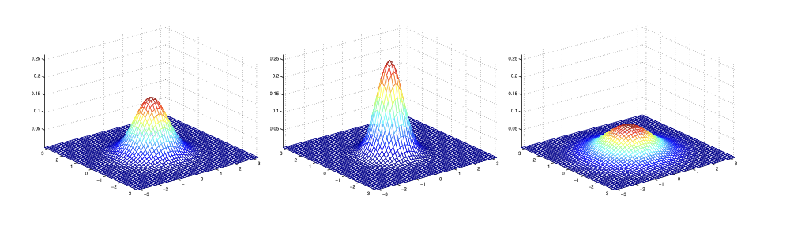

# Generative Learning Algorithms

到目前为止，我们主要讨论的是对 $p(y|x;\theta)$ 进行建模的学习算法，即给定 $x$ 条件下 $y$ 的条件分布。例如，逻辑回归将 $p(y|x;\theta)$ 建模为 $h_\theta(x) = g(\theta^Tx)$，其中 $g$ 是sigmoid函数。在这些笔记中，我们将讨论一种不同类型的学习算法。

考虑一个分类问题，我们想要学习区分大象（$y = 1$）和狗（$y = 0$），基于动物的一些特征。给定训练集，逻辑回归或感知器算法（基本上）试图找到一条直线——即决策边界——将大象和狗分开。然后，要将新动物分类为大象或狗，它会检查该动物落在决策边界的哪一侧，并据此做出预测。

这里有一个不同的方法。首先，观察大象，我们可以建立一个大象外观的模型。然后，观察狗，我们可以建立一个狗外观的单独模型。最后，要对新动物进行分类，我们可以将新动物与大象模型进行匹配，并将其与狗模型进行匹配，看看新动物是更像我们在训练集中看到的大象还是更像狗。

直接尝试学习 $p(y|x)$（如逻辑回归）的算法，或尝试直接从输入空间 $\mathcal{X}$ 到标签 $\{0,1\}$ 学习映射的算法（如感知器算法）被称为**判别式**学习算法。这里，我们将讨论尝试对 $p(x|y)$（和 $p(y)$）进行建模的算法。这些算法被称为**生成式**学习算法。例如，如果 $y$ 表示一个例子是狗（0）还是大象（1），那么 $p(x|y=0)$ 对狗的特征分布进行建模，而 $p(x|y=1)$ 对大象的特征分布进行建模。

在对 $p(y)$（称为**类先验**）和 $p(x|y)$ 进行建模后，我们的算法可以使用贝叶斯规则推导出 $y$ 给定 $x$ 的后验分布：

\begin{aligned}
p(y|x) = \frac{p(x|y)p(y)}{p(x)}.
\end{aligned}

这里，分母由 $p(x) = p(x|y=1)p(y=1) + p(x|y=0)p(y=0)$ 给出（你应该能够从概率的标准性质验证这一点），因此也可以用我们学习的 $p(x|y)$ 和 $p(y)$ 来表示。事实上，如果我们计算 $p(y|x)$ 是为了做出预测，那么我们实际上不需要计算分母，因为

\begin{aligned}
\arg\max_y p(y|x) = \arg\max_y \frac{p(x|y)p(y)}{p(x)} = \arg\max_y p(x|y)p(y).
\end{aligned}

## 高斯判别分析

我们将看的第一个生成学习算法是高斯判别分析（GDA）。在这个模型中，我们假设 $p(x|y)$ 按照多元正态分布分布。让我们在继续讨论GDA模型本身之前，简要讨论多元正态分布的性质。

### 多元正态分布

$d$维多元正态分布，也称为多元高斯分布，由一个**均值向量** $\mu \in \mathbb{R}^d$ 和一个**协方差矩阵** $\Sigma \in \mathbb{R}^{d \times d}$ 参数化，其中 $\Sigma \geq 0$ 是对称且半正定的。也写作 "$\mathcal{N}(\mu, \Sigma)$"，其密度由下式给出：

\begin{aligned}
p(x; \mu, \Sigma) = \frac{1}{(2\pi)^{d/2}|\Sigma|^{1/2}} \exp\left(-\frac{1}{2}(x-\mu)^T\Sigma^{-1}(x-\mu)\right).
\end{aligned}

在上面的等式中，"$|\Sigma|$"表示矩阵 $\Sigma$ 的行列式。

对于一个服从 $\mathcal{N}(\mu, \Sigma)$ 分布的随机变量 $X$，均值（不出意外地）由 $\mu$ 给出：

\begin{aligned}
E[X] = \int_x x p(x; \mu, \Sigma)dx = \mu
\end{aligned}

向量值随机变量 $Z$ 的**协方差**定义为 $\text{Cov}(Z) = E[(Z - E[Z])(Z - E[Z])^T]$。这推广了实值随机变量的方差概念。如果 $X \sim \mathcal{N}(\mu, \Sigma)$，则

\begin{aligned}
\text{Cov}(X) = \Sigma.
\end{aligned}

下面是高斯分布密度的一些示例：

最左边的图显示了一个均值为零（即2x1零向量）和协方差矩阵 $\Sigma = I$（2x2单位矩阵）的高斯分布。具有零均值和单位协方差的高斯分布也称为**标准正态分布**。中间的图显示了一个均值为零和 $\Sigma = 0.6I$ 的高斯分布的密度；右图显示了一个 $\Sigma = 2I$ 的高斯分布。我们看到，随着 $\Sigma$ 变大，高斯分布变得更"分散"，而随着 $\Sigma$ 变小，分布变得更"压缩"。

让我们看更多的例子。

上图显示了均值为0，协方差矩阵分别为 

$$\Sigma = \begin{bmatrix} 1 & 0 \\ 0 & 1 \end{bmatrix}; \Sigma = \begin{bmatrix} 1 & 0.5 \\ 0.5 & 1 \end{bmatrix}; \Sigma = \begin{bmatrix} 1 & 0.8 \\ 0.8 & 1 \end{bmatrix}.$$

最左边的图显示了熟悉的标准正态分布，我们看到，随着 $\Sigma$ 中非对角元素的增加，密度朝着45°线（由 $x_1 = x_2$ 给出）变得更"压缩"。当我们看同样三个密度的等高线图时，可以更清楚地看到这一点：

这里还有最后一组通过改变 $\Sigma$ 生成的例子：

上面的图分别使用了 

$$\Sigma = \begin{bmatrix} 1 & -0.5 \\ -0.5 & 1 \end{bmatrix}; \Sigma = \begin{bmatrix} 1 & -0.8 \\ -0.8 & 1 \end{bmatrix}; \Sigma = \begin{bmatrix} 3 & 0.8 \\ 0.8 & 1 \end{bmatrix}.$$

从最左边和中间的图中，我们看到通过减小协方差矩阵的非对角元素，密度再次"压缩"，但方向相反。最后，随着我们改变参数，更一般地说，等高线将形成椭圆（右图显示了一个例子）。

作为我们的最后一组例子，固定 $\Sigma = I$，通过改变 $\mu$，我们也可以移动密度的均值。

上图是使用 $\Sigma = I$ 生成的，分别使用以下均值向量：

$$\mu = \begin{bmatrix} 1 \\ 0 \end{bmatrix}; \mu = \begin{bmatrix} -0.5 \\ 0 \end{bmatrix}; \mu = \begin{bmatrix} -1 \\ -1.5 \end{bmatrix}.$$

### 高斯判别分析模型

当我们有一个分类问题，其中输入特征 $x$ 是连续值随机变量时，我们可以使用高斯判别分析（GDA）模型，该模型使用多元正态分布对 $p(x|y)$ 进行建模。模型如下：

\begin{aligned}
y &\sim \text{Bernoulli}(\phi)\\
x|y=0 &\sim \mathcal{N}(\mu_0, \Sigma)\\
x|y=1 &\sim \mathcal{N}(\mu_1, \Sigma)
\end{aligned}

具体写出这些分布，我们有：

\begin{aligned}
p(y) &= \phi^y(1-\phi)^{1-y}\\
p(x|y=0) &= \frac{1}{(2\pi)^{d/2}|\Sigma|^{1/2}} \exp\left(-\frac{1}{2}(x-\mu_0)^T\Sigma^{-1}(x-\mu_0)\right)\\
p(x|y=1) &= \frac{1}{(2\pi)^{d/2}|\Sigma|^{1/2}} \exp\left(-\frac{1}{2}(x-\mu_1)^T\Sigma^{-1}(x-\mu_1)\right)
\end{aligned}

这里，我们模型的参数是 $\phi$、$\Sigma$、$\mu_0$ 和 $\mu_1$。（注意，虽然有两个不同的均值向量 $\mu_0$ 和 $\mu_1$，但这个模型通常应用于只有一个协方差矩阵 $\Sigma$ 的情况。）数据的对数似然函数由下式给出：

\begin{aligned}
\ell(\phi, \mu_0, \mu_1, \Sigma) &= \log \prod_{i=1}^n p(x^{(i)}, y^{(i)}; \phi, \mu_0, \mu_1, \Sigma)\\
&= \log \prod_{i=1}^n p(x^{(i)}|y^{(i)}; \mu_0, \mu_1, \Sigma)p(y^{(i)}; \phi).
\end{aligned}

通过关于参数最大化 $\ell$，我们得到参数的最大似然估计：

\begin{aligned}
\phi &= \frac{1}{n}\sum_{i=1}^n 1\{y^{(i)} = 1\}\\
\mu_0 &= \frac{\sum_{i=1}^n 1\{y^{(i)} = 0\}x^{(i)}}{\sum_{i=1}^n 1\{y^{(i)} = 0\}}\\
\mu_1 &= \frac{\sum_{i=1}^n 1\{y^{(i)} = 1\}x^{(i)}}{\sum_{i=1}^n 1\{y^{(i)} = 1\}}\\
\Sigma &= \frac{1}{n}\sum_{i=1}^n (x^{(i)} - \mu_{y^{(i)}})(x^{(i)} - \mu_{y^{(i)}})^T.
\end{aligned}

从图示上看，算法的工作原理如下：

图中显示了训练集，以及适合每个类别数据的两个高斯分布的等高线。注意，这两个高斯分布具有相同的形状和方向，因为它们共享协方差矩阵 $\Sigma$，但它们有不同的均值 $\mu_0$ 和 $\mu_1$。图中还显示了 $p(y=1|x) = 0.5$ 的直线决策边界。在边界的一侧，我们预测 $y=1$ 是最可能的结果，而在另一侧，我们预测 $y=0$。

### 讨论：GDA与逻辑回归

GDA模型与逻辑回归有一个有趣的关系。如果我们将 $p(y=1|x;\phi,\mu_0,\mu_1,\Sigma)$ 视为关于 $x$ 的函数，我们会发现它可以表示为：

\begin{aligned}
p(y=1|x;\phi,\Sigma,\mu_0,\mu_1) = \frac{1}{1+\exp(-\theta^Tx)},
\end{aligned}

其中 $\theta$ 是 $\phi$、$\Sigma$、$\mu_0$ 和 $\mu_1$ 的某个适当函数。¹ 这正是逻辑回归（一种判别式算法）用来模型 $p(y=1|x)$ 的形式。

什么时候我们会更倾向于选择一种模型而不是另一种？GDA和逻辑回归在应用于同一数据集时，通常会给出不同的决策边界。哪一个更好？

我们刚刚论证了，如果 $p(x|y)$ 是多元高斯分布（具有共享 $\Sigma$），那么 $p(y|x)$ 必然遵循逻辑函数。然而，反过来并不成立；即 $p(y|x)$ 是逻辑函数并不意味着 $p(x|y)$ 是多元高斯分布。这表明GDA对数据做出了更强的建模假设，比逻辑回归更强。事实证明，当这些建模假设正确时，GDA会找到更适合数据的模型，是一个更好的选择。具体来说，当 $p(x|y)$ 确实是高斯分布（具有共享 $\Sigma$）时，GDA是**渐近有效**的。非正式地说，这意味着在非常大的训练集（大 $n$）的情况下，没有算法比GDA更好（例如，在估计 $p(y|x)$ 的准确性方面）。特别是，可以证明在这种情况下，GDA将是比逻辑回归更好的算法；而且，即使对于小规模训练集，我们也会普遍期望GDA表现更好。

相比之下，由于做出了明显更弱的假设，逻辑回归也更加**稳健**，对不正确的建模假设不那么敏感。有许多不同的假设集可以导致 $p(y|x)$ 采取逻辑函数的形式。例如，如果 $x|y=0 \sim \text{Poisson}(\lambda_0)$ 和 $x|y=1 \sim \text{Poisson}(\lambda_1)$，那么 $p(y|x)$ 将是逻辑的。逻辑回归对这种泊松数据也能很好地工作。但如果我们对这样的非高斯数据使用GDA——并为这种非高斯数据拟合高斯分布——那么结果将不太可预测，GDA可能表现良好，也可能表现不佳。

总结：GDA做出更强的建模假设，当建模假设正确或至少近似正确时，它的数据效率更高（即，在"学好"的情况下需要较少的训练数据）。逻辑回归做出更弱的假设，对建模假设的偏差显著更稳健。具体来说，当数据确实是非高斯的，那么在大数据集的情况下，逻辑回归几乎总是比GDA表现更好。由于这个原因，在实践中，逻辑回归比GDA使用得更频繁。（一些相关的考虑也适用于我们接下来讨论的朴素贝叶斯算法，但朴素贝叶斯仍然被认为是一个非常好的，而且肯定也是一个非常流行的分类算法。）

## 朴素贝叶斯

在GDA中，特征向量 $x$ 是连续的、实值向量。现在我们来讨论一种不同的学习算法，其中 $x_j$ 是离散值的。

作为我们的激励例子，考虑使用机器学习构建电子邮件垃圾过滤器。在这里，我们希望根据邮件是否为垃圾邮件（unsolicited commercial email）或非垃圾邮件来对其进行分类。学会这样做之后，我们可以让我们的邮件阅读器自动过滤掉垃圾邮件，可能将它们放在一个单独的邮件文件夹中。对电子邮件进行分类是一个更广泛问题集合的一个例子，称为**文本分类**。

假设我们有一个训练集（一组被标记为垃圾邮件或非垃圾邮件的电子邮件）。我们将通过指定用来表示电子邮件的特征 $x_j$ 来开始构建我们的垃圾邮件过滤器。

我们将通过一个特征向量来表示一封电子邮件，该向量的长度等于词典中的单词数量。具体来说，如果一封电子邮件包含词典中的第 $j$ 个单词，则我们设置 $x_j = 1$；否则，我们设置 $x_j = 0$。例如，向量

\begin{aligned}
x = \begin{bmatrix} 1 \\ 0 \\ 0 \\ \vdots \\ 1 \\ \vdots \\ 0 \end{bmatrix} \quad \begin{array}{c} \text{a} \\ \text{aardvark} \\ \text{aardwolf} \\ \vdots \\ \text{buy} \\ \vdots \\ \text{zygmurgy} \end{array}
\end{aligned}

用于表示包含单词"a"和"buy"，但不包含"aardvark"、"aardwolf"或"zymurgy"的电子邮件。

这种表示电子邮件的方式被称为**词袋（bag-of-words）模型**。在这个模型中，我们不考虑单词出现的顺序，只关心每个单词是否出现。尽管这显然是一个相当简化的表示形式，但它证明在垃圾邮件过滤和其他许多文本分类问题上非常有效。

注意，在实践中，我们考虑一个大小合理的词典，也许使用大约50,000个最常用的英语单词。这暗示着我们有一个50,000维的特征向量，这是一个很大的向量。然而，对于任何特定的电子邮件，$x_j$中的绝大多数值将为0，因为大多数电子邮件只包含词典中的一小部分单词。这种向量，其中几乎所有元素都是0，被称为**稀疏**向量。在实践中处理如此高维的特征向量通常是可行的，因为我们可以利用向量的稀疏性来设计存储和操作它们的存储和计算效率方法。

现在，假设我们开发了一个简单的生成模型，我们可以如下建模。首先，我们指定类标签 $y$ 的先验分布 $p(y)$，其中 $y=1$ 表示垃圾邮件，$y=0$ 表示非垃圾邮件。然后，给定 $y$，$x_i$'s（即电子邮件中是否包含单词i）是条件独立的。这意味着，假设我们知道一封电子邮件是垃圾邮件（$y=1$），那么知道它包含单词"aardvark"（$x_1=1$）不会让我们更可能认为它同时也包含单词"buy"（$x_2=1$）。这种假设同样适用于非垃圾邮件（$y=0$）。通常，这种假设是不合理的，因为各种单词的出现是彼此相关的，但我们仍将做出这个假设以保持模型的简单性。

维基百科上有一个有趣的历史花絮：初次派生和使用朴素贝叶斯算法的是什么人？[（回答：朴素贝叶斯是在20世纪50年代在文本分类的背景下推导和使用的）]

形式上，我们的模型指定了联合分布如下：

\begin{aligned}
p(x_1, \ldots, x_n, y) = p(y) \prod_{i=1}^{n} p(x_i|y)
\end{aligned}

这反映了我们的条件独立性假设。该模型通常被称为**朴素贝叶斯分类器**，其中"朴素"一词指的是我们所做的（天真的）假设，即给定 $y$ 的条件下特征 $x_i$ 是相互独立的。

为了应用这个模型，我们需要参数 $\phi_{j|y=1} = p(x_j=1|y=1)$，$\phi_{j|y=0} = p(x_j=1|y=0)$，以及 $\phi_y = p(y=1)$。其中 $\phi_{j|y=1}$ 是垃圾邮件（$y=1$）包含单词j的概率，而 $\phi_{j|y=0}$ 是非垃圾邮件包含单词j的概率，$\phi_y$ 是任何特定电子邮件是垃圾邮件的先验概率。

给定一个训练集 $\{(x^{(i)}, y^{(i)}); i = 1, \ldots, m\}$，我们可以写出模型的对数似然函数：

\begin{aligned}
\ell(\phi_y, \phi_{j|y=0}, \phi_{j|y=1}) &= \log \prod_{i=1}^{m} p(x^{(i)}, y^{(i)})\\
&= \log \prod_{i=1}^{m} p(y^{(i)}) \prod_{j=1}^{n} p(x_j^{(i)} | y^{(i)})
\end{aligned}

最大化这个函数（关于 $\phi_y$，$\phi_{j|y=0}$，$\phi_{j|y=1}$），可以得到最大似然估计：

\begin{aligned}
\phi_{j|y=1} &= \frac{\sum_{i=1}^{m} 1\{x_j^{(i)} = 1 \wedge y^{(i)} = 1\}}{\sum_{i=1}^{m} 1\{y^{(i)} = 1\}}\\
\phi_{j|y=0} &= \frac{\sum_{i=1}^{m} 1\{x_j^{(i)} = 1 \wedge y^{(i)} = 0\}}{\sum_{i=1}^{m} 1\{y^{(i)} = 0\}}\\
\phi_y &= \frac{\sum_{i=1}^{m} 1\{y^{(i)} = 1\}}{m}
\end{aligned}

换句话说，$\phi_{j|y=1}$ 是我们训练集中标记为垃圾邮件的样本中，包含单词j的电子邮件的一小部分。$\phi_{j|y=0}$ 是我们训练集中标记为非垃圾邮件的样本中，包含单词j的电子邮件的一小部分。$\phi_y$ 是训练集中垃圾邮件的一小部分。这些都是相当自然的估计参数的方法。

在实际应用中，我们通常会对上述估计进行拉普拉斯平滑（Laplace smoothing）。例如，一个词在所有非垃圾邮件中从未出现过，即 $\phi_{j|y=0} = 0$。然后，如果一封新邮件包含了这个词，通过朴素贝叶斯公式，我们将计算出这封邮件是非垃圾邮件的概率为零。为了避免这个问题（这表明结果对训练集中没有出现的词非常敏感），我们添加一个平滑项：

\begin{aligned}
\phi_{j|y=1} &= \frac{1 + \sum_{i=1}^{n}1\{x_j^{(i)}=1 \wedge y^{(i)}=1\}}{2 + \sum_{i=1}^{n}1\{y^{(i)}=1\}}\\
\phi_{j|y=0} &= \frac{1 + \sum_{i=1}^{n}1\{x_j^{(i)}=1 \wedge y^{(i)}=0\}}{2 + \sum_{i=1}^{n}1\{y^{(i)}=0\}}
\end{aligned}

这相当于假设我们在每个 $y$ 类别中预先看到了两个额外的邮件，一个包含单词j，一个不包含。这确保了我们没有零概率。这被称为拉普拉斯平滑，是朴素贝叶斯应用中的一个重要技巧。

我们使用朴素贝叶斯来对新的电子邮件进行分类是很简单的。给定一个新邮件，我们可以使用贝叶斯规则计算 $p(y=1|x)$：

\begin{aligned}
p(y=1|x) &= \frac{p(x|y=1)p(y=1)}{p(x)}\\
&= \frac{p(x|y=1)p(y=1)}{p(x|y=1)p(y=1) + p(x|y=0)p(y=0)}
\end{aligned}

考虑到朴素贝叶斯条件独立性假设，我们可以进一步将 $p(x|y=1)$ 和 $p(x|y=0)$ 分解为：

\begin{aligned}
p(x|y=1) &= \prod_{j=1}^n p(x_j|y=1)\\
&= \prod_{j=1}^n (\phi_{j|y=1})^{x_j} (1-\phi_{j|y=1})^{1-x_j}
\end{aligned}

同样的，
\begin{aligned}
p(x|y=0) &= \prod_{j=1}^n p(x_j|y=0)\\
&= \prod_{j=1}^n (\phi_{j|y=0})^{x_j} (1-\phi_{j|y=0})^{1-x_j}
\end{aligned}

然后，我们预测 $y=1$（垃圾邮件）如果 $p(y=1|x) > 0.5$，否则预测 $y=0$。

实际上，朴素贝叶斯是一个相当有效的文本分类器，尽管它的条件独立性假设非常强烈和"朴素"。在许多文本分类任务中，它的表现几乎与更复杂的模型一样好，而且训练和预测速度都非常快。本课程后面会讨论其他文本分类算法。

选择了我们的特征向量后，我们现在要构建一个生成模型。因此，我们需要对 $p(x|y)$ 进行建模。但如果我们有一个包含50000个单词的词汇表，那么 $x \in \{0, 1\}^{50000}$（$x$ 是一个50000维的0和1的向量），如果我们使用多项式分布直接对 $x$ 建模，那么对 $2^{50000}$ 种可能的结果，我们最终会得到一个 $(2^{50000} - 1)$ 维的参数向量。这显然参数太多了。

为了对 $p(x|y)$ 进行建模，我们将做一个非常强的假设。我们将假设给定 $y$，$x_i$ 是条件独立的。这个假设被称为 **朴素贝叶斯（NB）假设**，由此产生的算法被称为 **朴素贝叶斯分类器**。例如，如果 $y = 1$ 表示垃圾邮件；"buy" 是词汇表中的第2087个词，"price" 是第39831个词；那么我们假设如果我告诉你 $y = 1$（某封特定邮件是垃圾邮件），那么知道 $x_{2087}$（知道"buy"是否出现在邮件中）不会影响你对 $x_{39831}$ 值的判断（"price"是否出现）。更正式地说，这可以写成 $p(x_{2087}|y) = p(x_{2087}|y, x_{39831})$。（注意，这与说 $x_{2087}$ 和 $x_{39831}$ 是独立的不同，后者可以写成 "$p(x_{2087}) = p(x_{2087}|x_{39831})$"；相反，我们只假设 $x_{2087}$ 和 $x_{39831}$ 在给定 $y$ 的情况下是条件独立的。）

现在我们有：

\begin{aligned}
p(x_1, \ldots, x_{50000}|y) &= p(x_1|y)p(x_2|y, x_1)p(x_3|y, x_1, x_2)\cdots p(x_{50000}|y, x_1, \ldots, x_{49999})\\
&= p(x_1|y)p(x_2|y)p(x_3|y)\cdots p(x_{50000}|y)\\
&= \prod_{j=1}^d p(x_j|y)
\end{aligned}

第一个等式简单地遵循概率的一般性质，第二个等式使用了朴素贝叶斯假设。我们注意到，即使朴素贝叶斯假设是一个极强的假设，但在许多问题上，这个算法仍然工作得很好。

我们的模型由 $\phi_{j|y=1} = p(x_j = 1|y = 1)$，$\phi_{j|y=0} = p(x_j = 1|y = 0)$，以及 $\phi_y = p(y = 1)$ 参数化。像往常一样，给定一个训练集 $\{(x^{(i)}, y^{(i)}); i = 1, \ldots, n\}$，我们可以写出数据的联合似然：

\begin{aligned}
\mathcal{L}(\phi_y, \phi_{j|y=0}, \phi_{j|y=1}) = \prod_{i=1}^n p(x^{(i)}, y^{(i)}).
\end{aligned}

关于 $\phi_y$，$\phi_{j|y=0}$ 和 $\phi_{j|y=1}$ 最大化这个似然，给出最大似然估计：

\begin{aligned}
\phi_{j|y=1} &= \frac{\sum_{i=1}^{n}1\{x_j^{(i)}=1 \wedge y^{(i)}=1\}}{\sum_{i=1}^{n}1\{y^{(i)}=1\}}\\
\phi_{j|y=0} &= \frac{\sum_{i=1}^{n}1\{x_j^{(i)}=1 \wedge y^{(i)}=0\}}{\sum_{i=1}^{n}1\{y^{(i)}=0\}}\\
\phi_y &= \frac{\sum_{i=1}^{n}1\{y^{(i)} = 1\}}{n}
\end{aligned}

在上面的等式中，"$\wedge$"符号表示"且"。参数有一个很自然的解释。例如，$\phi_{j|y=1}$ 仅仅是在垃圾邮件（$y=1$）中，单词 $j$ 出现的比例。

在拟合了所有这些参数后，要对一个新样本 $x$ 做预测，我们只需计算

\begin{aligned}
p(y=1|x) &= \frac{p(x|y=1)p(y=1)}{p(x)}\\
&= \frac{\left(\prod_{j=1}^{d}p(x_j|y=1)\right)p(y=1)}{\left(\prod_{j=1}^{d}p(x_j|y=1)\right)p(y=1) + \left(\prod_{j=1}^{d}p(x_j|y=0)\right)p(y=0)},
\end{aligned}

并选择具有更高后验概率的类别。

最后，我们注意到，虽然我们开发朴素贝叶斯算法主要针对特征 $x_j$ 是二值的情况，但将其推广到 $x_j$ 取值范围在 $\{1, 2, \ldots, k_j\}$ 中的情况是直接的。在这种情况下，我们会将 $p(x_j|y)$ 建模为多项式分布而不是伯努利分布。事实上，即使某些原始输入属性（例如，我们之前例子中的房屋生活面积）是连续值，也很常见的做法是将其**离散化**——即，将其转换成一小组离散值——然后应用朴素贝叶斯。例如，如果我们使用某个特征 $x_i$ 来表示生活面积，我们可能会按照以下方式将连续值离散化：

| 生活面积 (平方英尺) | < 400 | 400-800 | 800-1200 | 1200-1600 | >1600 |
|---------------------|-------|---------|----------|-----------|-------|
| $x_i$               | 1     | 2       | 3        | 4         | 5     |

因此，对于生活面积为 890 平方英尺的房子，我们会将相应的特征 $x_j$ 设为 3。然后我们可以应用朴素贝叶斯算法，正如前面所述，用多项分布对 $p(x_j|y)$ 进行建模。当原始的连续值属性无法用多元正态分布很好地建模时，离散化特征并使用朴素贝叶斯（而不是GDA）通常会得到更好的分类器。

### 拉普拉斯平滑

我们描述的朴素贝叶斯算法在许多问题上工作得相当好，但有一个简单的改变可以让它工作得更好，特别是对于文本分类。让我们简要讨论算法当前形式的一个问题，然后谈谈如何解决它。

考虑垃圾邮件分类，假设我们在20xx年，完成CS229并在项目上做了出色的工作后，你决定在20xx年5月左右将你的工作提交到NeurIPS会议发表。³ 因为你在邮件中讨论这个会议，你也开始收到包含"neurips"一词的邮件。但这是你第一篇NeurIPS论文，在此之前，你从未见过任何包含"neurips"一词的邮件；特别是，在你的垃圾邮件/非垃圾邮件训练集中从未出现过"neurips"这个词。假设"neurips"是词典中的第35000个单词，你的朴素贝叶斯垃圾邮件过滤器因此将参数 $\phi_{35000|y}$ 的最大似然估计设为

\begin{aligned}
\phi_{35000|y=1} &= \frac{\sum_{i=1}^{n}1\{x_{35000}^{(i)}=1 \wedge y^{(i)}=1\}}{\sum_{i=1}^{n}1\{y^{(i)}=1\}} = 0\\
\phi_{35000|y=0} &= \frac{\sum_{i=1}^{n}1\{x_{35000}^{(i)}=1 \wedge y^{(i)}=0\}}{\sum_{i=1}^{n}1\{y^{(i)}=0\}} = 0
\end{aligned}

也就是说，因为它在垃圾邮件或非垃圾邮件训练样本中都从未见过"neurips"，它认为在任一类型的邮件中看到这个词的概率为零。因此，当试图决定这些包含"neurips"的邮件中的一个是否是垃圾邮件时，它计算类后验概率，得到

\begin{aligned}
p(y=1|x) &= \frac{\prod_{j=1}^{d}p(x_j|y=1)p(y=1)}{\prod_{j=1}^{d}p(x_j|y=1)p(y=1) + \prod_{j=1}^{d}p(x_j|y=0)p(y=0)}\\
&= \frac{0}{0}.
\end{aligned}

这是因为每个"$\prod_{j=1}^{d}p(x_j|y)$"项都包含一个 $p(x_{35000}|y) = 0$ 的项，与其相乘。因此，我们的算法得到 $0/0$，不知道如何做出预测。

更广泛地说，仅仅因为你在有限的训练集中没有见过某个事件，就将其概率估计为零在统计上是个糟糕的主意。考虑估计取值在 $\{1,...,k\}$ 中的多项式随机变量 $z$ 的均值。我们可以用 $\phi_j = p(z = j)$ 参数化我们的多项式。给定一组 $n$ 个独立观察 $\{z^{(1)},...,z^{(n)}\}$，最大似然估计由下式给出：

\begin{aligned}
\phi_j = \frac{\sum_{i=1}^{n}1\{z^{(i)}=j\}}{n}.
\end{aligned}

正如我们之前看到的，如果使用这些最大似然估计，那么一些 $\phi_j$ 可能最终为零，这是个问题。为了避免这个问题，我们可以使用 **拉普拉斯平滑**，它用以下估计替代上面的估计：

\begin{aligned}
\phi_j = \frac{1 + \sum_{i=1}^{n}1\{z^{(i)}=j\}}{k + n}.
\end{aligned}

在这里，我们在分子上加了1，在分母上加了 $k$。注意 $\sum_{j=1}^{k}\phi_j = 1$ 仍然成立（自己检验一下！），这是个期望的特性，因为 $\phi_j$ 是我们知道必须和为1的概率的估计。此外，对于所有 $j$ 值，$\phi_j \neq 0$，解决了我们概率被估计为零的问题。在某些（可以说是相当强的）条件下，可以证明拉普拉斯平滑实际上给出了 $\phi_j$ 的最佳估计。

回到我们的朴素贝叶斯分类器，使用拉普拉斯平滑，我们因此得到以下参数估计：

\begin{aligned}
\phi_{j|y=1} &= \frac{1 + \sum_{i=1}^{n}1\{x_j^{(i)}=1 \wedge y^{(i)}=1\}}{2 + \sum_{i=1}^{n}1\{y^{(i)}=1\}}\\
\phi_{j|y=0} &= \frac{1 + \sum_{i=1}^{n}1\{x_j^{(i)}=1 \wedge y^{(i)}=0\}}{2 + \sum_{i=1}^{n}1\{y^{(i)}=0\}}
\end{aligned}

（在实践中，是否对 $\phi_y$ 应用拉普拉斯平滑通常影响不大，因为我们通常会有相当比例的垃圾邮件和非垃圾邮件，所以 $\phi_y$ 会是对 $p(y=1)$ 的合理估计，而且无论如何都会远离0。）

### 用于文本分类的事件模型

为了结束我们对生成学习算法的讨论，让我们再谈一个专门用于文本分类的模型。虽然我们介绍的朴素贝叶斯对许多分类问题都有效，但对于文本分类，有一个相关模型效果更好。

在文本分类的特定背景下，我们介绍的朴素贝叶斯使用的是所谓的**伯努利事件模型**（或有时称为**多变量伯努利事件模型**）。在这个模型中，我们假设邮件的生成方式是：首先随机确定（根据类先验 $p(y)$）是垃圾邮件发送者还是非垃圾邮件发送者将给你发送下一封邮件。然后，发送邮件的人会浏览词典，独立决定是否在邮件中包含每个单词 $j$，概率为 $p(x_j=1|y) = \phi_{j|y}$。因此，消息的概率由 $p(y)\prod_{j=1}^d p(x_j|y)$ 给出。

这里有一个不同的模型，称为**多项式事件模型**。为了描述这个模型，我们将使用不同的表示法和特征集来表示邮件。我们让 $x_j$ 表示邮件中第j个单词的身份。因此，$x_j$ 现在是一个整数，取值范围为 $\{1,\ldots,|V|\}$，其中 $|V|$ 是我们词汇表（词典）的大小。一封有 $d$ 个单词的邮件现在由一个长度为 $d$ 的向量 $(x_1, x_2, \ldots, x_d)$ 表示；注意 $d$ 可能因文档而异。例如，如果一封邮件以 "A NeurIPS..." 开头，那么 $x_1 = 1$（"a"是词典中的第一个单词），$x_2 = 35000$（如果"neurips"是词典中的第35000个单词）。

在多项式事件模型中，我们假设邮件的生成方式是通过一个随机过程，首先确定是垃圾邮件/非垃圾邮件（根据 $p(y)$），如前所述。然后，邮件发送者通过首先从某个关于单词的多项式分布生成 $x_1$（$p(x_1|y)$）来编写邮件。接下来，第二个单词 $x_2$ 独立于 $x_1$ 但从同一多项式分布中选择，对于 $x_3$、$x_4$ 等也是如此，直到生成邮件的所有 $d$ 个单词。因此，消息的总体概率由 $p(y)\prod_{j=1}^d p(x_j|y)$ 给出。注意，这个公式看起来像我们之前在伯努利事件模型中的概率公式，但公式中的项现在有完全不同的含义。特别是，$x_j|y$ 现在是多项式分布，而不是伯努利分布。

我们新模型的参数是 $\phi_y = p(y)$（与之前一样），$\phi_{k|y=1} = p(x_j = k|y = 1)$（对任何 $j$）和 $\phi_{k|y=0} = p(x_j = k|y = 0)$。注意，我们假设 $p(x_j|y)$ 对于所有 $j$ 值都是相同的（即，一个单词的生成分布不依赖于它在邮件中的位置 $j$）。

如果给定一个训练集 $\{(x^{(i)}, y^{(i)}); i = 1, \ldots, n\}$，其中 $x^{(i)} = (x_1^{(i)}, x_2^{(i)}, \ldots, x_{d_i}^{(i)})$（这里，$d_i$ 是第i个训练样例中的单词数），数据的似然由以下式子给出：

\begin{aligned}
\mathcal{L}(\phi_y, \phi_{k|y=0}, \phi_{k|y=1}) &= \prod_{i=1}^n p(x^{(i)}, y^{(i)})\\
&= \prod_{i=1}^n \left(\prod_{j=1}^{d_i} p(x_j^{(i)}|y; \phi_{k|y=0}, \phi_{k|y=1})\right) p(y^{(i)}; \phi_y).
\end{aligned}

最大化这个似然得到参数的最大似然估计：

\begin{aligned}
\phi_{k|y=1} &= \frac{\sum_{i=1}^n \sum_{j=1}^{d_i} 1\{x_j^{(i)} = k \wedge y^{(i)} = 1\}}{\sum_{i=1}^n 1\{y^{(i)} = 1\}d_i}\\
\phi_{k|y=0} &= \frac{\sum_{i=1}^n \sum_{j=1}^{d_i} 1\{x_j^{(i)} = k \wedge y^{(i)} = 0\}}{\sum_{i=1}^n 1\{y^{(i)} = 0\}d_i}\\
\phi_y &= \frac{\sum_{i=1}^n 1\{y^{(i)} = 1\}}{n}.
\end{aligned}

如果我们在估计 $\phi_{k|y=0}$ 和 $\phi_{k|y=1}$ 时应用拉普拉斯平滑（这在实践中对于良好表现是必要的），我们在分子上加1，在分母上加 $|V|$，得到：

\begin{aligned}
\phi_{k|y=1} &= \frac{1 + \sum_{i=1}^n \sum_{j=1}^{d_i} 1\{x_j^{(i)} = k \wedge y^{(i)} = 1\}}{|V| + \sum_{i=1}^n 1\{y^{(i)} = 1\}d_i}\\
\phi_{k|y=0} &= \frac{1 + \sum_{i=1}^n \sum_{j=1}^{d_i} 1\{x_j^{(i)} = k \wedge y^{(i)} = 0\}}{|V| + \sum_{i=1}^n 1\{y^{(i)} = 0\}d_i}.
\end{aligned}

虽然不一定是最佳的分类算法，朴素贝叶斯分类器通常表现得出人意料地好。由于其简单性和实现容易，它也经常是"首先尝试"的好选择。

