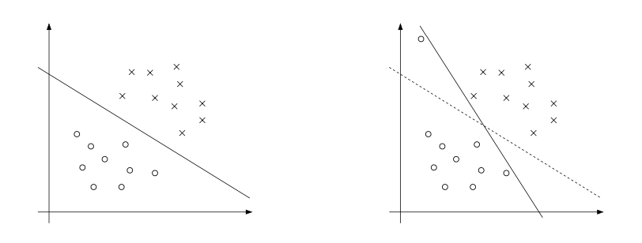
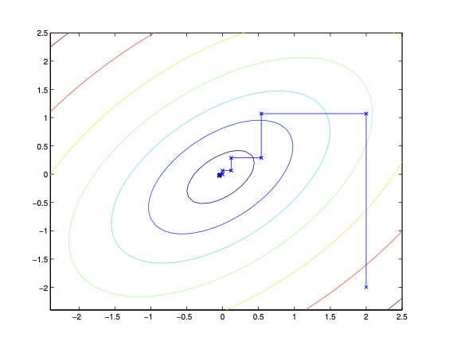

# Chapter 6

## Support vector machines

本套笔记介绍支持向量机（SVM）学习算法。SVM是最好的（很多人认为确实是最好的）"现成的"监督学习算法之一。要讲述SVM的故事，我们首先需要讨论边界（margins）和用较大"间隙"分离数据的想法。接下来，我们将讨论最优边界分类器，这将引导我们探讨拉格朗日对偶性。我们还将看到核函数，它们提供了一种在非常高维度（例如无限维度）特征空间中高效应用SVM的方法，最后，我们将以SMO算法结束讨论，该算法提供了SVM的高效实现。

## Margins: intuition

我们将通过讨论边界来开始SVM的故事。本节将给出关于边界和预测"置信度"的直观理解；这些想法将在后续部分正式化。

考虑逻辑回归，其中概率 $p(y = 1|x; \theta)$ 由 $h_\theta(x) = g(\theta^T x)$ 建模。当输入 $x$ 满足 $h_\theta(x) \geq 0.5$ 时，我们预测"1"，等价地，当且仅当 $\theta^T x \geq 0$ 时。考虑一个正训练样本（$y = 1$）。$\theta^T x$ 越大，$h_\theta(x) = p(y = 1|x; \theta)$ 也越大，因此我们对标签为1的"置信度"也越高。因此，非正式地说，如果 $\theta^T x \gg 0$，我们可以认为我们的预测非常有信心 $y = 1$。类似地，如果 $\theta^T x \ll 0$，我们可以认为逻辑回归非常有信心预测 $y = 0$。给定一个训练集，再次非正式地说，如果我们能找到 $\theta$ 使得 $\theta^T x^{(i)} \gg 0$ 当 $y^{(i)} = 1$ 时，以及 $\theta^T x^{(i)} \ll 0$ 当 $y^{(i)} = 0$ 时，这将反映一组非常有信心（且正确）的对所有训练样本的分类。这似乎是一个很好的目标，我们很快将使用函数边界的概念来形式化这个想法。

对于不同类型的直观理解，考虑下图，其中 x 表示正训练样本，o 表示负训练样本，决策边界（即由方程 $\theta^T x = 0$ 给出的线，也称为分离超平面）也显示出来，并且三个点也被标记为 A、B 和 C。

注意点 A 离决策边界很远。如果我们被要求预测 A 处的 $y$ 值，我们应该非常有信心 $y = 1$。相反，点 C 非常接近决策边界，虽然它在决策边界上预测 $y = 1$ 的一侧，但决策边界的轻微变化很容易导致预测变为 $y = 0$。因此，我们对 A 点的预测比对 C 点的预测更有信心。点 B 介于这两种情况之间，更广泛地说，我们看到如果一个点远离分离超平面，那么我们的预测可能会更有信心。再次非正式地说，如果给定一个训练集，我们能够找到一个允许我们对训练样本进行所有正确且有信心（意味着远离决策边界）预测的决策边界，那将会很好。我们将在后面使用几何边界的概念来形式化这一点。

## Notation

为了使我们对SVM的讨论更容易，我们需要引入一种新的表示法来讨论分类。我们将考虑一个用于二元分类问题的线性分类器，其中标签为 $y$ 和特征为 $x$。从现在开始，我们将使用 $y \in \{-1, 1\}$（而不是 $\{0, 1\}$）来表示类标签。此外，我们将不再使用向量 $\theta$ 参数化线性分类器，而是使用参数 $w, b$，并将我们的分类器写为：

\begin{aligned}
h_{w,b}(x) = g(w^T x + b).
\end{aligned}

这里，$g(z) = 1$ 如果 $z \geq 0$，否则 $g(z) = -1$。这种 "w, b" 表示法使我们能够明确地将截距项 $b$ 与其他参数分开处理。（我们还放弃了之前使用 $x_0 = 1$ 作为输入特征向量中额外坐标的约定。）因此，$b$ 承担了之前 $\theta_0$ 的角色，而 $w$ 承担了 $[\theta_1, \ldots, \theta_n]^T$ 的角色。

需要注意的是，根据上面对 $g$ 的定义，我们的分类器将直接预测 1 或 -1（比如感知器算法），而不需要经过估计 $p(y = 1)$ 的中间步骤（这是逻辑回归所做的）。

## Functional and geometric margins

让我们形式化函数边界和几何边界的概念。给定一个训练样本 $(x^{(i)}, y^{(i)})$，我们定义 $(w, b)$ 相对于训练样本的**函数边界**为：

\begin{aligned}
\hat{\gamma}^{(i)} = y^{(i)}(w^T x^{(i)} + b).
\end{aligned}

注意，如果 $y^{(i)} = 1$，那么为了使函数边界较大（即，我们的预测有信心且正确），我们需要 $w^T x^{(i)} + b$ 是一个较大的正数。相反，如果 $y^{(i)} = -1$，那么为了使函数边界较大，我们需要 $w^T x^{(i)} + b$ 是一个较大的负数。此外，如果 $y^{(i)}(w^T x^{(i)} + b) > 0$，那么我们对这个样本的预测是正确的。（自己检查一下。）因此，大的函数边界代表有信心和正确的预测。

对于采用上述给定的 $g$（取值于 $\{-1, 1\}$）的线性分类器，函数边界有一个属性使其不是很好的置信度度量。给定我们对 $g$ 的选择，我们注意到，如果我们将 $w$ 替换为 $2w$ 和 $b$ 替换为 $2b$，则由于 $g(w^T x + b) = g(2w^T x + 2b)$，这不会改变 $h_{w,b}(x)$ 的值。即，$g$，因此也是 $h_{w,b}(x)$，取决于 $w^T x + b$ 的符号，但不取决于其大小。然而，将 $(w, b)$ 替换为 $(2w, 2b)$ 也会导致函数边界乘以2。因此，通过利用我们自由地缩放 $w$ 和 $b$ 的能力，我们可以使函数边界任意大，而不真正改变任何有意义的东西。直观上，因此施加某种规范化条件如 $\|w\|_2 = 1$ 可能有意义；即，我们可能会用 $(w/\|w\|_2, b/\|w\|_2)$ 替换 $(w, b)$，而考虑 $(w/\|w\|_2, b/\|w\|_2)$ 的函数边界。我们稍后会回到这一点。

给定训练集 $S = \{(x^{(i)}, y^{(i)}); i = 1, \ldots, n\}$，我们还定义 $(w, b)$ 相对于 $S$ 的函数边界为各个训练样本的函数边界中的最小值。用 $\hat{\gamma}$ 表示，这可以写为：

\begin{aligned}
\hat{\gamma} = \min_{i=1,\ldots,n} \hat{\gamma}^{(i)}.
\end{aligned}

接下来，让我们谈谈**几何边界**。考虑下图：

显示了对应于 $(w, b)$ 的决策边界，以及向量 $w$。请注意 $w$ 与分离超平面正交（成90°角）。（你应该说服自己这必须是这样的。）考虑点 A，它表示某个标签为 $y^{(i)} = 1$ 的训练样本的输入 $x^{(i)}$。它到决策边界的距离 $\gamma^{(i)}$ 由线段 AB 给出。

我们如何找到 $\gamma^{(i)}$ 的值？嗯，$w/\|w\|$ 是一个单位长度的向量，指向与 $w$ 相同的方向。由于 A 表示 $x^{(i)}$，我们发现点 B 由 $x^{(i)} - \gamma^{(i)} \cdot w/\|w\|$ 给出。但是这个点位于决策边界上，所有位于决策边界上的点 $x$ 都满足方程 $w^T x + b = 0$。因此，

\begin{aligned}
w^T \left(x^{(i)} - \gamma^{(i)} \frac{w}{\|w\|}\right) + b = 0.
\end{aligned}

解得 $\gamma^{(i)}$ 得到

\begin{aligned}
\gamma^{(i)} = \frac{w^T x^{(i)} + b}{\|w\|} = \left(\frac{w}{\|w\|}\right)^T x^{(i)} + \frac{b}{\|w\|}.
\end{aligned}

这是为了正训练样本 A 在图中的情况，其中位于决策边界"正"侧是好的。更一般地，我们定义 $(w, b)$ 相对于训练样本 $(x^{(i)}, y^{(i)})$ 的几何边界为：

\begin{aligned}
\gamma^{(i)} = y^{(i)}\left(\left(\frac{w}{\|w\|}\right)^T x^{(i)} + \frac{b}{\|w\|}\right).
\end{aligned}

注意，如果 $\|w\| = 1$，则函数边界等于几何边界——这给了我们一种联系这两种不同边界概念的方法。同样，几何边界对参数重新缩放是不变的；即，如果我们将 $w$ 替换为 $2w$ 和 $b$ 替换为 $2b$，则几何边界不会改变。这事实上在后面会很有用。具体来说，由于参数缩放对几何边界的这种不变性，当尝试拟合 $w$ 和 $b$ 到训练数据时，我们可以在 $w$ 上施加任意的缩放约束而不改变任何重要的东西；例如，我们可以要求 $\|w\| = 1$，或 $|w_1| = 5$，或 $|w_1 + b| + |w_2| = 2$，这些都可以通过简单地重新缩放 $w$ 和 $b$ 来满足。

最后，给定一个训练集 $S = \{(x^{(i)}, y^{(i)}); i = 1, \ldots, n\}$，我们还定义 $(w, b)$ 相对于 $S$ 的几何边界为各个训练样本的几何边界中的最小值：

\begin{aligned}
\gamma = \min_{i=1,\ldots,n} \gamma^{(i)}.
\end{aligned}

## The optimal margin classifier

给定一个训练集，从之前的讨论看来，一个自然的期望是尝试找到一个能够最大化（几何）边界的决策边界，因为这将反映一组对训练集的非常有信心的预测和对训练数据的良好"拟合"。具体来说，这将导致一个分类器，它用一个"间隙"（几何边界）分离正负训练样本。

现在，我们将假设我们有一个线性可分的训练集；即，存在可能使用某种分离超平面分离正负样本。我们如何找到实现最大几何边界的超平面？我们可以提出以下优化问题：

\begin{aligned}
\max_{\gamma,w,b} & \gamma \\
\text{s.t. } & y^{(i)}(w^T x^{(i)} + b) \geq \gamma, \quad i = 1, \ldots, n \\
& \|w\| = 1.
\end{aligned}

即，我们想要最大化 $\gamma$，要求每个训练样本的函数边界至少为 $\gamma$。约束 $\|w\| = 1$ 进一步确保函数边界等于几何边界，所以我们也保证所有几何边界至少为 $\gamma$。因此，解决这个问题将得到相对于训练集具有最大可能几何边界的 $(w, b)$。

如果我们能解决上述优化问题，我们就完成了。但 $\|w\| = 1$ 约束是一个（非凸）约束，这个问题肯定不是任何格式的问题，我们可以插入标准优化软件来解决。所以，让我们尝试将问题转换成更好的形式。考虑：

\begin{aligned}
\max_{\gamma,w,b} & \frac{\gamma}{\|w\|} \\
\text{s.t. } & y^{(i)}(w^T x^{(i)} + b) \geq \hat{\gamma}, \quad i = 1, \ldots, n
\end{aligned}

这里，我们要最大化 $\gamma/\|w\|$，要求所有函数边界至少为 $\hat{\gamma}$。由于几何和函数边界通过关系 $\gamma = \hat{\gamma}/\|w\|$ 相关，这将给我们我们想要的答案。此外，我们摆脱了我们不喜欢的约束 $\|w\| = 1$。缺点是我们现在有一个讨厌的（同样，非凸）目标函数 $\frac{\gamma}{\|w\|}$；而且，我们仍然没有现成的软件可以解决这种形式的优化问题。

让我们继续。回忆我们之前的讨论，我们可以对 $w$ 和 $b$ 添加任意的缩放约束而不改变任何事情。这是我们现在将使用的关键思想。我们将引入缩放约束，使训练集的函数边界必须为1：

\begin{aligned}
\hat{\gamma} = 1.
\end{aligned}

由于乘以 $w$ 和 $b$ 的某个常数会导致函数边界乘以相同的常数，这确实是一个缩放约束，可以通过重新缩放 $w, b$ 来满足。将这个代入我们的问题上面，并注意到最大化 $\gamma/\|w\| = 1/\|w\|$ 与最小化 $\|w\|^2$ 是一样的，我们现在有以下优化问题：

\begin{aligned}
\min_{w,b} & \frac{1}{2}\|w\|^2 \\
\text{s.t. } & y^{(i)}(w^T x^{(i)} + b) \geq 1, \quad i = 1, \ldots, n
\end{aligned}

我们现在已经将问题转化为一种可以被高效求解的形式。上述是一个凸二次目标函数和只有线性约束的优化问题。其解给了我们**最优边界分类器**。这个优化问题可以使用商业二次规划(QP)代码求解。

虽然我们可以调用问题解决在这里，但我们将转而做一个关于拉格朗日对偶性的讨论。这将引导我们得到优化问题的对偶形式，这在允许我们使用核函数让最优边界分类器在非常高维的特征空间中高效工作方面将发挥关键作用。对偶形式也将允许我们推导一个比通用QP软件通常更好的算法来求解上述优化问题的高效算法。

## Lagrange duality

让我们暂时撇开SVM和最大边界分类器，谈谈解决约束优化问题。

考虑以下形式的问题：

\begin{aligned}
\min_w & f(w) \\
\text{s.t. } & h_i(w) = 0, \quad i = 1, \ldots, l.
\end{aligned}

你们中的一些人可能记得如何使用拉格朗日乘数法来解决它。（如果你还没见过它，不用担心。）在这种方法中，我们定义**拉格朗日函数**为：

\begin{aligned}
\mathcal{L}(w, \beta) = f(w) + \sum_{i=1}^l \beta_i h_i(w)
\end{aligned}

这里，$\beta_i$ 称为**拉格朗日乘子**。我们接下来找出并设置 $\mathcal{L}$ 的偏导数为零：

\begin{aligned}
\frac{\partial \mathcal{L}}{\partial w_i} = 0; \quad \frac{\partial \mathcal{L}}{\partial \beta_i} = 0,
\end{aligned}

然后解出 $w$ 和 $\beta$。

在本节中，我们将这个思路推广到约束优化问题，其中既有不等式约束又有等式约束。由于篇幅限制，我们无法在这个课程中详细讲解拉格朗日对偶理论，但我们会给出主要思想和结果，然后将其应用到我们的最优边界分类器优化问题中。

考虑以下问题，我们称之为**原始**优化问题：

\begin{aligned}
\min_w \quad & f(w) \\
\text{s.t.} \quad & g_i(w) \leq 0, \quad i = 1, \ldots, k \\
& h_i(w) = 0, \quad i = 1, \ldots, l
\end{aligned}

为了解决它，我们首先定义**广义拉格朗日函数**：

\begin{aligned}
\mathcal{L}(w, \alpha, \beta) = f(w) + \sum_{i=1}^k \alpha_i g_i(w) + \sum_{i=1}^l \beta_i h_i(w).
\end{aligned}

这里，$\alpha_i$ 和 $\beta_i$ 是拉格朗日乘子。考虑以下量：

\begin{aligned}
\theta_P(w) = \max_{\alpha,\beta:\alpha_i\geq0} \mathcal{L}(w, \alpha, \beta).
\end{aligned}

这里，"P"下标表示"原始"。假设给定某个 $w$。如果 $w$ 违反了任何原始约束（即，如果 $g_i(w) > 0$ 或 $h_i(w) \neq 0$ 对于某些 $i$），那么你应该能够验证：

\begin{aligned}
\theta_P(w) &= \max_{\alpha,\beta:\alpha_i\geq0} \left[ f(w) + \sum_{i=1}^k \alpha_i g_i(w) + \sum_{i=1}^l \beta_i h_i(w) \right]\\
&= \infty.
\end{aligned}

相反，如果对于特定的 $w$ 值，约束确实得到满足，那么 $\theta_P(w) = f(w)$。因此，

\begin{aligned}
\theta_P(w) = 
\begin{cases} 
f(w) & \text{如果 } w \text{ 满足原始约束} \\
\infty & \text{否则}
\end{cases}
\end{aligned}

因此，$\theta_P$ 对于满足原始约束的 $w$ 值取与目标函数相同的值，对于违反约束的 $w$ 值取正无穷。所以，如果我们考虑最小化问题：

\begin{aligned}
\min_w \theta_P(w) = \min_w \max_{\alpha,\beta:\alpha_i\geq0} \mathcal{L}(w, \alpha, \beta),
\end{aligned}

我们看到它与原始问题（即，具有相同解）是相同的问题。为后续使用，我们还定义目标函数的最优值为 $p^* = \min_w \theta_P(w)$；我们称这为原始问题的**值**。

现在，让我们看一个稍微不同的问题。我们定义：

\begin{aligned}
\theta_D(\alpha, \beta) = \min_w \mathcal{L}(w, \alpha, \beta).
\end{aligned}

这里，"D"下标代表"对偶"。注意，在 $\theta_P$ 的定义中，我们对 $\alpha, \beta$ 进行优化（最大化），而这里我们对 $w$ 进行最小化。

我们现在可以提出**对偶**优化问题：

\begin{aligned}
\max_{\alpha,\beta:\alpha_i\geq0} \theta_D(\alpha, \beta) = \max_{\alpha,\beta:\alpha_i\geq0} \min_w \mathcal{L}(w, \alpha, \beta).
\end{aligned}

这与上面显示的原始问题完全相同，只是"max"和"min"的顺序现在交换了。我们还定义对偶问题目标函数的最优值为 $d^* = \max_{\alpha,\beta:\alpha_i\geq0} \theta_D(w)$。

原始问题和对偶问题有什么关系？可以很容易地证明：

\begin{aligned}
d^* = \max_{\alpha,\beta:\alpha_i\geq0} \min_w \mathcal{L}(w, \alpha, \beta) \leq \min_w \max_{\alpha,\beta:\alpha_i\geq0} \mathcal{L}(w, \alpha, \beta) = p^*.
\end{aligned}

（你应该说服自己这一点；这源于函数的"max min"总是小于或等于"min max"。）然而，在某些条件下，我们会有：

\begin{aligned}
d^* = p^*,
\end{aligned}

这样我们就可以解决对偶问题而不是原始问题。让我们看看这些条件是什么。

假设 $f$ 和 $g_i$ 是凸函数，且 $h_i$ 是仿射函数（即线性函数加上常数项）。假设进一步 $g_i$ 约束是（严格）可行的；这意味着存在某个 $w$ 使得 $g_i(w) < 0$ 对于所有 $i$。

在我们上述假设下，必存在 $w^*, \alpha^*, \beta^*$ 使得 $w^*$ 是原始问题的解，$\alpha^*, \beta^*$ 是对偶问题的解，且 $p^* = d^* = \mathcal{L}(w^*, \alpha^*, \beta^*)$。此外，$w^*, \alpha^*$ 和 $\beta^*$ 满足**Karush-Kuhn-Tucker (KKT) 条件**，如下：

\begin{aligned}
\frac{\partial}{\partial w_i}\mathcal{L}(w^*, \alpha^*, \beta^*) &= 0, \quad i=1, \ldots, d\\
\frac{\partial}{\partial \beta_i}\mathcal{L}(w^*, \alpha^*, \beta^*) &= 0, \quad i=1, \ldots, l\\
\alpha_i^*g_i(w^*) &= 0, \quad i=1, \ldots, k\\
g_i(w^*) &\leq 0, \quad i=1, \ldots, k\\
\alpha^* &\geq 0, \quad i=1, \ldots, k
\end{aligned}

此外，如果某些 $w^*, \alpha^*, \beta^*$ 满足KKT条件，则它也是原始和对偶问题的解。

我们特别关注方程 (6.5)，被称为KKT**对偶互补**条件。具体来说，它意味着如果 $\alpha_i^* > 0$，那么 $g_i(w^*) = 0$。（换句话说，约束是活跃的，意味着它以等式而非不等式成立。）后面，这对于表明SVM只有少量"支持向量"将是关键；当我们讨论SMO算法时，KKT对偶互补条件也将给我们提供收敛测试。

## Optimal margin classifiers: the dual form

注意：优化问题(6.8)和优化问题(6.12)的等价性，以及方程(6.10)中主变量和对偶变量之间的关系是本节最重要的要点。

之前，我们提出了以下（原始）优化问题来寻找最优边界分类器：

\begin{aligned}
\min_{w,b} &\frac{1}{2}||w||^2\\
\text{s.t.} &y^{(i)}(w^Tx^{(i)} + b) \geq 1, \quad i=1,\ldots,n
\end{aligned}

我们可以将约束写为：

\begin{aligned}
g_i(w) = -y^{(i)}(w^Tx^{(i)} + b) + 1 \leq 0.
\end{aligned}

我们对每个训练样本都有一个这样的约束。注意，从KKT对偶互补条件，我们知道仅对那些函数边界恰好等于1的训练样本（即，对应于约束等式成立的那些，$g_i(w) = 0$），$\alpha_i > 0$。考虑下图，其中显示了一个最大边界分离超平面，由实线表示。

边界最小的点恰好是最接近决策边界的点；在这里，这是虚线上的三个点（一个负例和两个正例）。因此，只有这三个 $\alpha_i$——即，对应于这三个训练样本的那些——将在最优解中非零。这三个点被称为该问题中的**支持向量**。支持向量的数量远小于训练集大小这一事实稍后将很有用。

让我们继续。展望未来，我们开发对偶形式的一个关键思想是，我们将尝试以仅依赖内积 $\langle x^{(i)},x^{(j)} \rangle$（可以视为 $(x^{(i)})^Tx^{(j)}$）的方式编写我们的算法，即输入特征空间中点之间的内积。我们能够以这些内积表达我们的算法这一事实在我们应用核技巧时将是关键。

当我们为我们的优化问题构建拉格朗日函数时，我们有：

\begin{aligned}
\mathcal{L}(w,b,\alpha) = \frac{1}{2}||w||^2 - \sum_{i=1}^n \alpha_i \left[y^{(i)}(w^Tx^{(i)} + b) - 1 \right].
\end{aligned}

注意这里只有"$\alpha_i$"而没有"$\beta_i$"拉格朗日乘子，因为问题只有不等式约束。

让我们找出问题的对偶形式。为此，我们需要首先关于 $w$ 和 $b$（对于固定的 $\alpha$）最小化 $\mathcal{L}(w,b,\alpha)$ 以得到 $\theta_D$，我们通过设置 $\mathcal{L}$ 关于 $w$ 和 $b$ 的导数为零来实现。我们有：

\begin{aligned}
\nabla_w \mathcal{L}(w,b,\alpha) = w - \sum_{i=1}^n \alpha_i y^{(i)} x^{(i)} = 0
\end{aligned}

这意味着

\begin{aligned}
w = \sum_{i=1}^n \alpha_i y^{(i)} x^{(i)}.
\end{aligned}

对于关于 $b$ 的导数，我们得到

\begin{aligned}
\frac{\partial}{\partial b}\mathcal{L}(w,b,\alpha) = \sum_{i=1}^n \alpha_i y^{(i)} = 0.
\end{aligned}

如果我们取方程(6.10)中的 $w$ 定义并将其代入拉格朗日函数(6.9)中，并简化，我们得到：

\begin{aligned}
\mathcal{L}(w,b,\alpha) = \sum_{i=1}^n \alpha_i - \frac{1}{2}\sum_{i,j=1}^n y^{(i)}y^{(j)}\alpha_i\alpha_j(x^{(i)})^Tx^{(j)} - b\sum_{i=1}^n\alpha_i y^{(i)}.
\end{aligned}

但根据方程(6.11)，最后一项必须为零，所以我们得到：

\begin{aligned}
\mathcal{L}(w,b,\alpha) = \sum_{i=1}^n \alpha_i - \frac{1}{2}\sum_{i,j=1}^n y^{(i)}y^{(j)}\alpha_i\alpha_j(x^{(i)})^Tx^{(j)}.
\end{aligned}

回想我们是通过关于 $w$ 和 $b$ 最小化 $\mathcal{L}$ 到达上面的方程的。将这与约束 $\alpha_i \geq 0$（我们一直有的）和约束(6.11)结合，我们得到以下对偶优化问题：

\begin{aligned}
\max_{\alpha} W(\alpha) &= \sum_{i=1}^n \alpha_i - \frac{1}{2}\sum_{i,j=1}^n y^{(i)}y^{(j)}\alpha_i\alpha_j \langle x^{(i)},x^{(j)}\rangle\\
\text{s.t.} \quad \alpha_i &\geq 0, \quad i=1,\ldots,n\\
\sum_{i=1}^n \alpha_i y^{(i)} &= 0,
\end{aligned}

你也应该能够验证满足 $p^* = d^*$ 和KKT条件（方程6.3-6.7）成立的条件确实在我们的优化问题中满足。

所以，我们可以解决对偶问题而不是原始问题。具体地，在上面的对偶问题中，我们有一个最大化问题，其中参数是 $\alpha_i$。我们稍后会谈到我们将用来解决对偶问题的具体算法，但如果我们确实能够解决它（即，找到最大化 $W(\alpha)$ 的 $\alpha$ 值，满足约束），那么我们可以使用方程(6.10)回过头来找到最优 $w$ 作为 $\alpha$ 的函数。对于原始问题，通过考虑拦截项 $b$ 找到的最优值也很简单，为：

\begin{aligned}
b^* = -\frac{\max_{i:y^{(i)}=-1} w^{*T}x^{(i)} + \min_{i:y^{(i)}=1}w^{*T}x^{(i)}}{2}.
\end{aligned}

（自己检查这是否正确。）

在继续之前，让我们也更仔细地看看方程(6.10)，它给出了 $w$ 的最优值，以（最优值）$\alpha$ 的形式。假设我们已经将我们的模型参数拟合到了训练集，现在想要在新的输入点 $x$ 上做预测。我们会计算 $w^Tx + b$，如果这个量大于零，我们预测 $y = 1$。但使用(6.10)，这个量也可以写成：

\begin{aligned}
w^Tx + b &= \left(\sum_{i=1}^n \alpha_i y^{(i)}x^{(i)}\right)^T x + b\\
&= \sum_{i=1}^n \alpha_i y^{(i)}\langle x^{(i)},x \rangle + b.
\end{aligned}

因此，如果我们已经找到了 $\alpha_i$，为了做出预测，我们需要计算的量只依赖于 $x$ 和训练集中点之间的内积。而且，我们之前看到 $\alpha_i$ 除了支持向量外，对所有点都是零。因此，许多上面总和中的项将为零，我们真正需要找的只是 $x$ 和支持向量（通常只有少量）之间的内积，以便计算(6.15)并做出我们的预测。

通过检查优化问题的对偶形式，我们对问题的结构有了重要的洞察，并且还能够将整个算法写成仅依赖于输入特征向量之间的内积的形式。在下一节，我们将利用这个性质来应用核方法到我们的分类问题。因此产生的算法，**支持向量机**，将能够在非常高维的特征空间中高效学习。

## Regularization and the non-separable case

SVM的推导到目前为止假设数据是线性可分的。虽然通过 $\phi$ 映射数据到高维特征空间通常会增加数据可分离的可能性，但我们不能保证它总是会这样。此外，在某些情况下，找到一个精确的分离超平面可能不是我们想做的，因为它可能容易受到异常值的影响。例如，左图显示一个最优边界超平面，当在左上区域添加一个单独的异常值（右图）时，它导致决策边界发生剧烈变化，并且产生的分类器的边界变得小得多。

为了使算法对非线性可分数据集也能工作，并且对异常值不那么敏感，我们重新表述我们的优化问题（使用 $\ell_1$ 正则化）如下：

\begin{aligned}
\min_{w,b} \quad &\frac{1}{2}||w||^2 + C\sum_{i=1}^n \xi_i\\
\text{s.t.} \quad &y^{(i)}(w^Tx^{(i)} + b) \geq 1 - \xi_i, \quad i = 1,\ldots, n\\
&\xi_i \geq 0, \quad i=1,\ldots,n
\end{aligned}

这样，样本现在被允许有（函数）边界小于1，如果一个样本有函数边界 $1 - \xi_i$（其中 $\xi > 0$），我们将为目标函数增加 $C\xi_i$ 的成本。参数 $C$ 控制了两个目标之间的相对权重：使 $||w||^2$ 小（我们之前看到这使得边界变大）和确保大多数样本的函数边界至少为1。

如之前一样，我们可以形成拉格朗日函数：

\begin{aligned}
\mathcal{L}(w,b,\xi,\alpha,r) = \frac{1}{2}w^Tw + C\sum_{i=1}^n\xi_i - \sum_{i=1}^n \alpha_i[y^{(i)}(x^Tw + b) - 1 + \xi_i] - \sum_{i=1}^n r_i\xi_i.
\end{aligned}

这里，$\alpha_i$ 和 $r_i$ 是我们的拉格朗日乘子（约束为 $\geq 0$）。我们不会详细地推导对偶形式，但在设置关于 $w$ 和 $b$ 的导数为零后，代入它们，并简化，我们得到以下对偶问题形式：

\begin{aligned}
\max_{\alpha} \quad W(\alpha) &= \sum_{i=1}^n \alpha_i - \frac{1}{2}\sum_{i,j=1}^n y^{(i)}y^{(j)}\alpha_i\alpha_j\langle x^{(i)},x^{(j)}\rangle\\
\text{s.t.} \quad 0 \leq \alpha_i &\leq C, \quad i=1,\ldots,n\\
\sum_{i=1}^n \alpha_i y^{(i)} &= 0,
\end{aligned}

和之前一样，我们也有 $w$ 可以以 $\alpha_i$ 的形式表达，如方程(6.10)所示，所以在解决对偶问题后，我们可以继续使用方程(6.15)做出我们的预测。注意，有些令人惊讶的是，在添加 $\xi_i$ 正则化后，对偶问题唯一的变化是，原来是约束 $0 \leq \alpha_i$ 现在变成了约束 $0 \leq \alpha_i \leq C$。$b^*$ 的计算也必须修改（方程6.13不再有效）；参见下一节/Platt's论文的评论。

此外，KKT对偶互补条件（在下一节中对于测试SMO算法的收敛性将很有用）是：

\begin{aligned}
\alpha_i = 0 &\Rightarrow y^{(i)}(w^Tx^{(i)} + b) \geq 1\\
\alpha_i = C &\Rightarrow y^{(i)}(w^Tx^{(i)} + b) \leq 1\\
0 < \alpha_i < C &\Rightarrow y^{(i)}(w^Tx^{(i)} + b) = 1.
\end{aligned}

现在，剩下的就是给出一个实际解决对偶问题的算法，我们将在下一节中做到。

## The SMO algorithm

SMO（序列最小优化）算法，由John Platt提出，提供了一种高效的方法来解决由SVM推导产生的对偶问题。为了激发SMO算法的动机，同时因为它本身也很有趣，让我们先来谈谈坐标上升算法。

## Coordinate ascent

考虑尝试解决无约束的优化问题：

\begin{aligned}
\max_{\alpha} W(\alpha_1, \alpha_2, \ldots, \alpha_n).
\end{aligned}

这里，我们把 $W$ 看作是参数 $\alpha_i$ 的某个函数，暂时忽略这个问题与SVM的任何关系。我们已经看过其他优化算法，如梯度上升和牛顿法。我们现在要考虑的新算法称为**坐标上升**：

循环直到收敛：{
  对于 $i = 1, \ldots, n$ {
    $\alpha_i := \arg\max_{\hat{\alpha}_i} W(\alpha_1, \ldots, \alpha_{i-1}, \hat{\alpha}_i, \alpha_{i+1}, \ldots, \alpha_n)$
  }
}

因此，在这个算法的最内层循环中，我们将固定除某个 $\alpha_i$ 外的所有变量，并仅针对参数 $\alpha_i$ 重新优化 $W$。在这里呈现的这个方法版本中，内层循环按顺序 $\alpha_1, \alpha_2, \ldots, \alpha_n, \alpha_1, \alpha_2, \ldots$ 重新优化变量。（更复杂的版本可能选择其他顺序；例如，我们可能选择下一个要更新的变量，期望它能让我们在 $W(\alpha)$ 中取得最大的增益）

当 $W$ 函数形式使得内层循环中的"arg max"可以高效执行时，坐标上升可以是一个相当高效的算法。下面是坐标上升算法的运行图：

图中的椭圆是我们想要优化的二次函数的等高线。坐标上升初始化在 $(2, -2)$，图中还绘制了它在通往全局最大值的路径。注意，在每一步中，坐标上升采取平行于坐标轴的步骤，因为每次只优化一个变量。

## SMO

我们通过概述SMO算法的推导来结束对SVM的讨论。

这是我们要解决的（对偶）优化问题：

\begin{aligned}
\max_{\alpha} \quad W(\alpha) &= \sum_{i=1}^n \alpha_i - \frac{1}{2}\sum_{i,j=1}^n y^{(i)}y^{(j)}\alpha_i\alpha_j\langle x^{(i)}, x^{(j)}\rangle\\
\text{s.t.} \quad 0 \leq \alpha_i &\leq C, \quad i = 1, \ldots, n\\
\sum_{i=1}^n \alpha_i y^{(i)} &= 0
\end{aligned}

假设我们有一组满足约束(6.20-6.21)的 $\alpha_i$。现在，假设我们想固定 $\alpha_2, \ldots, \alpha_n$，并采取坐标上升步骤重新优化目标函数关于 $\alpha_1$。我们能取得任何进展吗？

答案是否定的，因为约束(6.21)确保：

\begin{aligned}
\alpha_1 y^{(1)} = -\sum_{i=2}^n \alpha_i y^{(i)}.
\end{aligned}

或者，通过将两边乘以 $y^{(1)}$，我们等效地有：

\begin{aligned}
\alpha_1 = -y^{(1)}\sum_{i=2}^n \alpha_i y^{(i)}.
\end{aligned}

（这一步使用了事实 $y^{(1)} \in \{-1, 1\}$，因此 $(y^{(1)})^2 = 1$。）因此，$\alpha_1$ 完全由其他 $\alpha_i$ 确定，如果我们固定 $\alpha_2, \ldots, \alpha_n$，那么我们就不能在不违反约束(6.21)的情况下对 $\alpha_1$ 做任何改变。

因此，如果我们想更新 $\alpha_i$ 的子集，我们必须同时更新至少两个参数以保持满足约束条件。这激发了SMO算法，它简单地执行以下操作：

重复直到收敛 {
  1. 选择一对 $\alpha_i$ 和 $\alpha_j$ 下一个更新（使用一种启发式方法，试图选择两个将允许我们朝着全局最大值取得最大进展的参数）
  2. 重新优化 $W(\alpha)$ 关于 $\alpha_i$ 和 $\alpha_j$，同时固定所有其他 $\alpha_k$（$k \neq i, j$）
}

要测试此算法的收敛性，我们可以检查KKT条件（6.16-6.18）是否在某个 $tol$ 范围内得到满足。这里，$tol$ 是收敛容差参数，通常设置为约0.01到0.001。（有关详细信息，请参见论文和伪代码。）

SMO是一种高效算法的关键原因是对 $\alpha_i$ 和 $\alpha_j$ 的更新可以非常高效地计算。现在让我们简要概述推导高效更新的主要思路。

假设我们当前有满足约束(6.20-6.21)的 $\alpha_i$，并假设我们已决定固定 $\alpha_3, \ldots, \alpha_n$，并要关于 $\alpha_1$ 和 $\alpha_2$ 重新优化 $W(\alpha_1, \alpha_2, \ldots, \alpha_n)$（受约束）。从(6.21)，我们要求：

\begin{aligned}
\alpha_1 y^{(1)} + \alpha_2 y^{(2)} = -\sum_{i=3}^n \alpha_i y^{(i)}.
\end{aligned}

由于右侧是固定的（因为我们固定了 $\alpha_3, \ldots, \alpha_n$），我们可以将其表示为某个常数 $\zeta$：

\begin{aligned}
\alpha_1 y^{(1)} + \alpha_2 y^{(2)} = \zeta.
\end{aligned}

我们可以如下图示 $\alpha_1$ 和 $\alpha_2$ 上的约束：

从约束(6.20)，我们知道 $\alpha_1$ 和 $\alpha_2$ 必须位于显示的框 $[0, C] \times [0, C]$ 内。还绘制了线 $\alpha_1 y^{(1)} + \alpha_2 y^{(2)} = \zeta$，$\alpha_1$ 和 $\alpha_2$ 必须位于这条线上。注意，从这些约束，我们知道 $L \leq \alpha_2 \leq H$；否则，$(\alpha_1, \alpha_2)$ 不能同时满足盒约束和直线约束。在这个例子中，$L = 0$。但取决于 $\alpha_1 y^{(1)} + \alpha_2 y^{(2)} = \zeta$ 这条线的样子，情况并非总是如此；但更一般地，对于 $\alpha_2$ 的可允许值将有一些下界 $L$ 和一些上界 $H$，使得 $\alpha_1, \alpha_2$ 必须位于盒 $[0, C] \times [0, C]$ 内。

使用方程(6.22)，我们也可以将 $\alpha_1$ 写成 $\alpha_2$ 的函数：

\begin{aligned}
\alpha_1 = (\zeta - \alpha_2 y^{(2)})y^{(1)}.
\end{aligned}

（检查这个推导；我们再次使用了 $y^{(1)} \in \{-1, 1\}$ 因此 $(y^{(1)})^2 = 1$。）因此，目标 $W(\alpha)$ 可以写成：

\begin{aligned}
W(\alpha_1, \alpha_2, \ldots, \alpha_n) = W((\zeta - \alpha_2 y^{(2)})y^{(1)}, \alpha_2, \ldots, \alpha_n).
\end{aligned}

将 $\alpha_3, \ldots, \alpha_n$ 视为常量，你应该能够验证这只是 $\alpha_2$ 的某个二次函数。即，这也可以表示为形式 $a\alpha_2^2 + b\alpha_2 + c$，其中 $a, b$ 和 $c$ 是适当的常数。如果我们忽略"盒约束"（6.20）（或等效地，假设 $L \leq \alpha_2 \leq H$），那么我们可以通过将其导数设为零并求解来轻松最大化这个二次函数。我们将让 $\alpha_2^{new,unclipped}$ 表示结果 $\alpha_2$ 值。你也应该能够说服自己，如果我们想要最大化 $W$ 关于 $\alpha_2$ 但受盒约束，那么我们可以通过取 $\alpha_2^{new,unclipped}$ 并将其"剪切"到 $[L, H]$ 区间来简单地找到最优值，得到：

\begin{aligned}
\alpha_2^{new} = 
\begin{cases}
H & \text{如果 } \alpha_2^{new,unclipped} > H \\
\alpha_2^{new,unclipped} & \text{如果 } L \leq \alpha_2^{new,unclipped} \leq H \\
L & \text{如果 } \alpha_2^{new,unclipped} < L
\end{cases}
\end{aligned}

最后，找到 $\alpha_2^{new}$ 后，我们可以使用方程(6.22)返回并找到 $\alpha_1^{new}$ 的最优值。

还有一些其他细节，很容易但我们将留给你自己阅读Platt的论文：一个是用于选择下一个要更新的 $\alpha_i, \alpha_j$ 的启发式方法；另一个是如何在SMO算法运行时更新 $b$。
