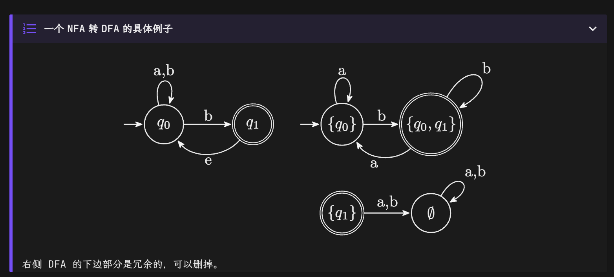

# 计算理论基础

> 基本转载自 [鹤翔万里的笔记本](https://note.tonycrane.cc/cs/tcs/toc/topic1/) 和 [咸鱼暄的代码空间](https://xuan-insr.github.io/compile_principle/1%20Lexical%20Analysis/#22-%E6%AD%A3%E5%88%99%E8%A1%A8%E8%BE%BE%E5%BC%8F--regular-expressions)

## 语言定义

- 字母表：finite set of symbols
  - $\Sigma = \{a,b,c\}$
- 字符串：finite sequence of symbols from $\Sigma$
  - $\Sigma^i$: set of all strings of length i over $\Sigma$
  - $\Sigma^* = \cup_{i\geq0} \Sigma_i, \Sigma_+ = \cup_{i\geq 1} \Sigma_i$
- 语言 Language over $\Sigma$：any subset of $\Sigma^*$

## 自动机

- Determinstic Finite Automata (DFA)：确定性有限自动机，每一步转移确定；
- Non-deterministic Finite Automata (NFA)：非确定性有限自动机，每一步的转移可以有多种选择

### DFA

定义为一个五元组 $M = (K,\Sigma,\delta,s,F)$

- $K$：状态集合
- $\Sigma$：字母表
- $\delta: K\times \Sigma \to K$，转移函数
- $s$：初始状态
- $F$：接受状态集合（即可以到达的状态）

Configuation：$C = (q,w)$，表示当前状态 $q$ 和剩余字符串 $w$.

Yields:

- yields in one step: 可一步转移到
  - 记为 $(q,w) \vdash_M (q',w')$, if $w = aw'$ for some $a \in \Sigma$ and $\delta(q,a) = q'$
  
- yields: 可转移到
  - 记为 $(q,w) \vdash_M^* (q',w')$, if $(q,w) \vdash_M (q_1,w_1) \vdash_M \cdots \vdash_M (q',w')$

自动机接受字符串

- $M$ accepts $w \in \Sigma^*$, if $(s,w) \vdash_M^* (q,e)$ for some $q \in F$ 即可以从初始状态 $s$ 通过一系列转移到接受状态 $q$，且剩余字符串为空

自动机对应的语言 (Language of $M$)
- $L(M) = \{ w \in \Sigma^* : M \text{ accepts } w \}$ 即所有能够被自动机接受的字符串

自动机接受的语言
- $M$ accepts $L$ if $M$ accepts every string in $L$ and rejects every string not in $L$
- $M$ accepts $L(M)$

## NFA

与 DFA 的区别：

- 一个状态同一条件，可以有多个转移方案
- 可以有 $e$-transition，即不消耗字符的转移

同样定义为五元组 $M = (K,\Sigma,\delta,s,F)$

- 和 DFA 区别只在 $\Delta$，是一个比函数更一般的关系
- $\Delta$：转移关系，$ \Delta \subseteq K \times (\Sigma \cup \{e\}) \times K $（有很多到达点，所以不是函数了）

对于一个输入，NFA 可以有多种路线，但只要有一种路线能够接受，就认为 NFA 接受该输入

## NFA 与 DFA

NFA 和 DFA 两者在本质上是等价的

- NFA 接收一个字符，会有多个转移方案，所有可达的下一状态合在一起的集合构成 DFA 的一个状态
- 即 DFA 的状态是 NFA 的状态的幂集（本来有 $n$ 个元素，现在有 $2^n$ 个），结束状态是包含 NFA 的结束状态的 DFA 状态
- $e$-transition 也要考虑，但是不算在字符数中

NFA $M = (K, \Sigma, \Delta, s, F)$ 转为 DFA $M' = (K', \Sigma, \delta, s', F')$
- $K' = 2^K = \{ Q : Q \subseteq K \}$
- $F' = \{ Q \in K' : Q \cap F \neq \emptyset \}$
- $s' = E(s)$
- 定义 $\forall q \in K, E(q) = \{ p \in K : (q,e) \vdash_M^* (p,e) \}$
  - 即 $E(q)$ 是 $q$ 可以通过 $e$-transition 到达的状态集合
- $\delta: \forall Q \in K', \forall a \in \Sigma$
  $$
  \delta(Q,a) = \bigcup_{q \in Q} \bigcup_{p : (q,a,p) \in \Delta} E(p)
  $$

## 正则语言

有自动机可以接受的语言是正则的。

### Regular Operations

- Union: $A \cup B = \{ w : w \in A \text{ or } w \in B \}$
  
- Concatenation: $A \circ B = \{ ab : a \in A \text{ and } b \in B \}$

- Star: $A^* = \{ w_1 w_2 \cdots w_k : k \geq 0 \text{ and each } w_i \in A \}$

**Theorem: ** 如果 $A$ 和 $B$ 是正则语言，则 $A \cup B$, $A \circ B$, $A^*$ 也是正则语言

### 正则表达式

**一个正规表达式由以下规则定义：**

- Atomic: 对于 $\emptyset$ 对应语言 $L(\emptyset) = \emptyset$, 对于 $a \in \Sigma$ 有 $L(a) = \{a\}$

- Composite:
  - $R_1 \cup R_2$ 对应语言 $L(R_1 \cup R_2) = L(R_1) \cup L(R_2)$
  - $R_1 R_2$ 对应语言 $L(R_1 R_2) = L(R_1) \circ L(R_2)$
  - $R_1^*$ 对应语言 $L(R_1^*) = L(R_1)^*$

- 优先级：$*$ > $\circ$ > $\cup$
	- Ex. $ab^* \cup b^*a = (a(b^*)) \cup ((b^*)a)$
	- $\emptyset^*$ 对应语言 $\{e\}$
	- $a(a \cup b)^*b$ 对应语言 $\{w \in \{a,b\}^* : w \text{ starts with } a \text{ and ends with } b\}$

	- $(a \cup b)^*a(a \cup b)^*a(a \cup b)^*$ 对应语言 $\{w \in \{a,b\}^* : w \text{ contains at least two } a\text{'s}\}$

**具体的正则表达式语法：**

称 language 为 string 的集合；string 是 symbol 的有限序列；symbol 是有有限 alphabet 中的元素。

每个正则表达式表示字符串的一个集合 (i.e. language)，即它可以匹配任意字符符号：

- Symbol: $a$, 匹配字符 "a"

- Alternation: $M$ 和 $N$ 是两个正则表达式, $M|N$ 可以匹配 $M$ 和 $N$ 匹配集合的并集。如 $a|b$ 可以匹配字符 "a" 或 "b"

- Concatenation: $M$ 和 $N$ 是两个正则表达式, $MN$ 可以匹配 $M$ 和 $N$ 中各一个字符的联合。如 $(a | b)b$ 匹配字符 "aa" 或 "ba"。

- Epsilon: $\varepsilon$, 匹配空字符串。如 $(a·b)|\varepsilon$ 代表语言 $("", "ab")$。

- Repetition: $M$ 是一个正则表达式，则用 $M^*$ 表示 Kleene 闭包 (Kleene closure)，即一个字符串是由 $M$ 中的字符串零至多次 concatenation 的结果，则该字符串属于 $M^*$。如 $((a|b)a)^*$ 表示无法集合 $("", "aa", "ba", "aaaa", "baaa", "aaba", "baba", "aaaaaa", ...)$。

在书写正则表达式时，我们有简省：和 $\varepsilon$，并规定 $*$ 优先级高于 $.$ 高于 $|$。还有一些缩写写形式：

- `[abcd]` 表示 `(a|b|c|d)`

- `[b-gM-Qkr]` 表示 `[bcdefgMNPQkr]`

- `M?` 表示 `(M|ϵ)`，即 `M` 出现 0 次或 1 次

- `M+` 表示 `(M·M*)`，即 `M` 至少 0 次

还有一些其他符号：

- `.` 表示除换符外的所有字符

Lex 和其他类似的词法分析器中规定了两个规则以消除二义性：

- Longest Match：输入的字符串中的最长的能与任一正则表达式匹配的子串（必须从头开始）为匹配到的 token

- Rule Priority：对匹配到的 longest substring，选择第一个与之匹配的正则表达式。即正则表达式的匹配顺序是有意义的