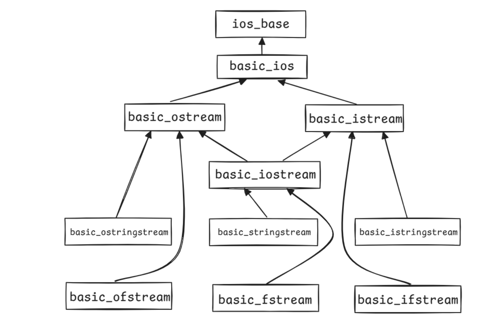
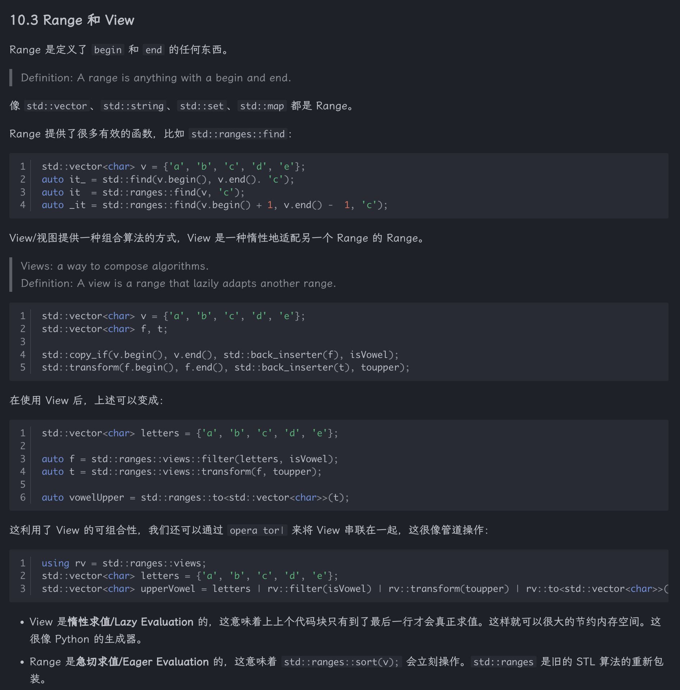

# CS106L

> 基本转载自 [xestray's website](https://xestray.cc/ComputerScience/PL/cpp/cs106l/) 和 [V1CeVersa's Notebook](https://note.v1ceversaa.cc/Computer%20Science/Programming%20Language/C%2B%2B/CS106L/)

## Basic Syntax

### Initialization

**直接初始化：**

```cpp
int num1 = 12.0;
int num2(12.0);
```

**统一初始化：**

```cpp
int num1 {12.0};
float num2 {12.0};
```

在这个初始化中，第一个会出现报错，它阻止了从 double 到 int 的窄化转换；但是 double 到 float 被认为是安全的。

**结构化绑定：**

```cpp
std::tuple<std::string, std::string, std::string> getClassInfo()
{
    std::string className = "CS106L";
    std::string buildingName = "Thornton 110";
    std::string language = "C++";
    return {className, buildingName, language};
}

int main() {
    auto [className, buildingName, language] = getClassInfo(); //只能使用 auto 关键字来自动推断变量的类型

    return 0;
}
```

### 引用

引用是某个已经存在的变量的别名，使用 `&` 符号来定义。对某个变量的引用和这个变量的标识符指向的是内存中的同一个地址，因此对引用的操作会直接影响到原变量。

在函数传参的时候，如果使用引用，那么就相当于传进来的参数是原来变量的别名，共用同一个内存。

### Stream

- cin：标准输入流，用于读取用户输入
- cout：标准输出流，用于输出信息（无缓冲）
- cerr：标准错误流，用于输出错误信息（无缓冲）
- clog：标准日志流，用于记录非关键事件的日志（有缓冲）



#### 类层次结构解析

1. 顶层基类

- `ios_base`：所有 I/O 相关类的基类，提供基本的 I/O 状态管理、格式化控制等功能。
- `basic_ios`：继承自 `ios_base`，是 `basic_istream` 和 `basic_ostream` 的共同基类，负责流的状态管理、错误处理等。

2. 基本输入/输出流

- `basic_ostream`（输出流基类）：用于输出数据，如 `std::cout`。
- `basic_istream`（输入流基类）：用于输入数据，如 `std::cin`。
- `basic_iostream`（输入输出流）：同时支持输入和输出，继承自 `basic_istream` 和 `basic_ostream`。

3. 字符串流（处理 `std::string`）

- `basic_ostringstream`：继承自 `basic_ostream`，用于写入字符串流（`std::ostringstream`）。
- `basic_istringstream`：继承自 `basic_istream`，用于读取字符串流（`std::istringstream`）。
- `basic_stringstream`：继承自 `basic_iostream`，支持字符串的读写（`std::stringstream`）。

4. 文件流（处理文件 I/O）

- `basic_ofstream`：继承自 `basic_ostream`，用于文件写操作（`std::ofstream`）。
- `basic_ifstream`：继承自 `basic_istream`，用于文件读操作（`std::ifstream`）。
- `basic_fstream`：继承自 `basic_iostream`，用于同时读写文件（`std::fstream`）。

`std::cout` 流是 `std::ostream` 的一个实例，`std::cin` 流是 `std::istream` 的一个实例。

#### 字符串流

```cpp
int main()
{
    std::string initial_quote = "Bjarne Stroustrup C makes it easy to shoot yourself in the foot";

    // 两种字符串流初始化方式
    // 1. 字符串构造函数
    std::stringstream ss(initial_quote);

    // 2. 插入字符串
    // std::stringstream ss;
    // ss << initial_quote;

    std::string first;
    std::string last;
    std::string language, extracted_quote;

    // >> 提取符按数据流顺序读取字符串的内容，
    // 以空白字符分隔（' ', '\n', '\t'）
    ss >> first >> last >> language >> extracted_quote;

    // 输出
    std::cout << first << "" << last << " said this: " << language << " " << extracted_quote << std::endl; 
}
```

`getline` 函数接口为 `istream& getline(istream& is, string& str, char delim)`

- `getline()`读取一串输入流`is`，直到读取字符 `delim` 时停止，将读到的数据存入缓冲区`str`中
- `delim` 默认为 `\n`
- `getline()` 读取的数据是会把字符 `delim` “消耗（consumes）” 掉，也会读取这个字符

#### 输出流

输出流的字符在被释放（flush）到目的地之前会被存储在一个中间缓冲区内，`std::endl` 除了换行之外，还会立即执行一次 flush 操作。

输出文件流（output file streams）的类型为 `std::ofstream`，同样采用 `<<` 插入符将数据送入文件内。

`std::ofstream` 常用的几种方法有

- `is_open()`
- `open()`
- `close()`
- `fail()`

```cpp
int main()
{
    // 在文件 hello.txt 中创建一个新的输出文件流
    std::ofstream ofs("hello.txt");

    // 检查文件是否打开，若是则将一段字符串写进文件内
    if (ofs.is_open())
    {
        ofs << "Hello CS106L!" << '\n';
    }

    // 关闭文件
    ofs.close();
sy
    // 由于文件已关闭，以下内容不会被写入 hello.txt 中
    ofs << "this will not get written";

    // 重新打开文件
    ofs.open("hello.txt");

    // 下面的字符串又可以被写入文件内，但是会覆盖文件原来的内容
    ofs << "this will though! It's open again";

    return 0;
}
```

## 模版类

- **类模版/Class Template**：是一个模版，用于生成类的定义，编译器会使用它来实例化各种具体的类。
- **模版类/Template Class**：是一个类模版实例化后的**具体类**，当使用类模版定义对象时，需要指定实际的类型参数，从而生成模版类。

定义一个类模版 `Vector`:

```cpp
template <typename T> class Vector {
   public:
    T& at(size_t index);
    void push_back(const T& elem);

   private:
    T* elems;
};
```

- 模版声明：`Vector` 是一个模版，接受类型参数 `T`；
- 模版实例化：当使用对应的实例（T 对应的类型）的时候，编译器会根据指定的具体类型生成相应的代码。
- 理解就是，最开头的 `template <typename>` 把后面需要用到的未知的类型给提前声明了。

```cpp
Vector<int> intVector;
Vector<std::string> stringVector;
```

- 除了 `typename`，模版参数还可以是别的类型，并且在模版中，`typename` 和 `class` 是等价的。

```cpp
template <typename T, std::size_t N> struct std::array;
std::array<int, 5> arr; // An array of exactly 5 integers

template <class T, std::size_t N> struct std::array;      // Equivalent to the above
```

- 声明成员函数的时候需要注意，对于上面类模版 `Vector` 而言，`Vector` 不是一个类型，但是 `Vector<T>` 是一个类型。

```cpp
template <typename T> T& Vector<T>::at(size_t index) {
    return elems[index];
}
```

- 如果我们在传参的时候声明 `const` 会怎么样？

```cpp
template <typename T> class Vector {
   public:
    size_t size();
    T& at(size_t index);
};

void printVec (const Vector<int>& vec) {
    for (size_t i = 0; i < vec.size(); ++i) {
        std::cout << vec.at(i) << std::endl;
    }
}
```

- 如果 `at` 和 `size` 没定义好的话，其实是会报错的：因为传参的 `const` 保证我传进来的参数一定不会被改变，因此，我要保证我这两个函数也不会改变参数：

```cpp
size_t size() const;
T& at(size_t index) const; 
```

- 在调用成员函数时，我们会把成员变量传入 `this` 的指针，而将成员函数定义为 const 的意义则是，保证这一个指向常量的指针，在成员函数中无法修改指针指向的值，也就是 `const Vector<int>* this`.

## 模版函数

```cpp
template <typename T> T min (const T &a, const T &b) {
    return a < b ? a : b;
}

template <typename T, typename U> auto min(const T &a, const U &b) {
    return a < b ? a : b;
}
```

实例化方法对应有两种：可以直接指定类型，也可以让编译器自行推断，但是推断的结果不一定如使用者本意（比如会把字符串字面量推断成 `const char*`）：

```cpp
min<int>(3, 4);                     // 显式实例化：编译器帮我们生成对应代码
min(3.14, 2.71);                    // 隐式实例化：编译器自行推断数据类型
min("hello", "world");              // 隐式实例化：编译器自行推断数据类型
min<const char*>("hello", "world"); // 显式实例化：上一行对应的其实是这个
```

更进一步的例子：

假如我们想要定义一个普适化的容器中的 find 函数：

```cpp
std::vector<int>::iterator find(
	std::vector<int>::iterator begin,
    std::vector<int>::iterator end,
    int value
) // This is too specfic!
```

改进以后的：

```cpp
template <class InputIt, class T> InputIt find(InputIt first, InputIt last, const T &value);
```


### Concept

假如我们要用类模版构建一个 set，那么我们实例化的类型就必须要具备“可比较”的特点，也就是说这个类型的小于号被定义了。

所以，假如我们创建了一个类模版，希望用这个类模版创建出的所有实例都具备这个“可比较”的特性，应该怎么做呢？

我们尝试定义一个 “Comparable” 的条件：

```cpp
template <typename T>
concept Comparable = requires(const T &a, const T &b) {
    { a < b } -> std::convertible_to<bool>;
};

```

- `concept`：代表限制的一个有名集合（a named set of constraints），“名字”就是这里的 `Comparable`，在方括号里，是限制的集合；
- `requires(const T &a, const T &b)`：指定类型 `T` 必须满足的条件，这里我们要求类型 `T` 必须能够接受两个常量引用参数，并且满足下面条件；
- `{ a < b } -> std::convertible_to<bool>`：这里我们要求花括号 `{}` 内的 `a < b` 必须不存在编译错误，并且返回值必须可以转换为 `bool` 类型。注意到 `std::convertible_to` 也是一个 concept。

在这个的基础上，我们就可以定义具有一定特性的实例函数了：

```cpp
template <typename T> requires Comparable<T>
T min(const T &a, const T &b);

template <Comparable T>
T min(const T &a, const T &b);
```

### 变参模板

> 这个 ... 太震撼了，递归的力量！

我们希望创建的函数可以接受任意数量参数。

```cpp
template <Comparable T>
T min(const T &v) { return v; }

template <Comparable T, Comparable... Args>
T min(const T &v, const Args &...args) {
    auto m = min(args...);
    return v < m ? v : m;
}
```

- 只有一个参数的版本是 Base Case Function；
- 省略号本质上是**递归**的定义；
- `Args` 是一个参数包，对应着 0 个或者更多种**类型**，`args` 是实际的参数值；
- 在 `auto m = min(args...);` 这一行执行了包展开，将 `args...` 展开成了真正的参数。

例如在 `min<int, int, int, int>(2, 7, 5, 1)` 的最初调用中：`T = int`，`Args = [int, int, int]`，然后我们求前 3 个的最小值，和第 4 个比，前 3 个递归……

编译器可以通过递归生成任意数量的重载，这使得我们可以支持任意数量的函数参数；实例化发生在编译时。

### 模版元编程

我们可以利用函数模板的特性来进行一些编译期的计算，这被称为模板元编程/Templates Metaprogramming。

```cpp
template <>
struct Factorial<0> {
    enum { value = 1 };     // enum: One way to store a compile-time constant
};

template <std::size_t N>
struct Factorial {
    enum { value = N * Factorial<N - 1>::value };
};

std::cout << Factorial<5>::value << std::endl;  // 120
```

TMP 是图灵完备的，我们可以在编译期执行任何代码！

`constexpr` 和 `consteval` 为我们提供了 TMP 的一个替代品：

```cpp
constexpr std::size_t factorial(std::size_t n) {
    if (n == 0) return 1;
    return n * factorial(n - 1);
}

consteval std::size_t factorial(std::size_t n) {
    if (n == 0) return 1;
    return n * factorial(n - 1);
}
```

- `constexpr`：允许编译时求值，但是如果条件不满足，可以退化为普通函数；
	- 要求：参数和返回值必须是字面值类型，不能有副作用，只能调用 `constexpr` 函数。
	- 性质：对应函数是纯函数，返回值隐含 `const` 属性。
- `consteval`：强制编译时求值，如果不能在编译时求值，则编译失败。
	- 要求：不能有静态变量，不能有副作用，不能在运行时上下文中调用。

## 函数与 Lambda 表达式

谓词函数/Predicate 是一个返回 `bool` 类型的函数，通常用于 STL 中，我们想通过传入谓词函数，可以进一步简化上一节中的 `find` 函数。

```cpp
template <typename It, typename Pred>
It find_if(It first, It last, Pred pred) {
    for (It it = first; it != last; ++it) {
        if (pred(*it)) return it;
    }
    return last;
}

bool isVowel(char c) {
    c = ::tolower(c);
    return c == 'a' || c == 'e' || c == 'i' || c == 'o' || c == 'u'; 
}

std::string s = "Hello, World!";
std::string::iterator it = find_if(s.begin(), s.end(), isVowel);
```

`Pred` 是一个函数指针，对上述式子来说，`Pred` 的类型是 `bool(*)(char)`，单纯传递函数指针作为参数是个很好的想法，然而函数指针的泛化能力有限（能够接受两个参数的函数指针并不存在）。因此，我们引入了 Lambda 表达式。

### Lambda 表达式

Lambda 函数是从所在的作用域捕获状态的函数。

```cpp
int n;
std::cin >> n;

auto lessThanN = [n](int x) { return x < n; };
```

Lambda 表达式的完整声明如下：`[capture-values](arguments) mutable exception-> return type { function-body };`：

- 方括号 `[]` 内的是捕获列表，可以让函数体内使用外侧的变量；
- 括号 `()` 内的是参数列表，和正常的函数无异；
- `mutable` 关键字表示 Lambda 函数可以修改捕获的变量；
- 花括号 `{}` 内的是函数体，但是只有参数列表和捕获的变量可以被访问。

捕获方式如下：

- `[x]`：按值捕获 x（创建副本）；
- `[x&]`：按引用捕获 x；
- `[x, y]`：按值捕获 x 和 y；
- `[&]`：按引用捕获所有变量；
- `[&, x]`：除了 x 按值捕获外，其他都按引用捕获；
- `[=]`：按值捕获所有变量。
- `[]`：不捕获任何变量。

```cpp
int n = 10;
auto lessThanN = [n](int x) { return x < n; }
find_if(begin, end, lessThanN);
```

就等价于（是下者的语法糖）：

```cpp
class __lambda_6_18 {
   public:
    bool operator()(int x) const { return x < n; }
    __lambda_6_18(int &n) : n{_n} {}
   private: 
    int n;
};

int n = 10;
auto lessThanN = __lambda_6_18(n);
find_if(begin, end, lessThanN);
```



## 重载运算符

```cpp
class StudentID {
   private:
    std::string name;
    std::string sunet;
    int idNumber;

   public:
    StudentID(const std::string &name, const std::string &sunet, int idNumber)
        : name(name), sunet(sunet), idNumber(idNumber) {}
    bool operator<(const StudentID &rhs) const { return idNumber < rhs.idNumber; }
    friend bool operator==(const StudentID &lhs, const StudentID &rhs);
};

bool operator>(const StudentID &lhs, const StudentID &rhs) { return rhs < lhs; }
bool operator==(const StudentID &lhs, const StudentID &rhs) {
    return lhs.idNumber == rhs.idNumber && lhs.name == rhs.name && lhs.sunet == rhs.sunet;
}
```

- 成员重载：如上面对 `operator<` 的重载，第一个操作数就是调用当前运算符的对象的引用；
- 非成员重载：如上面对 `operator==` 和 `operator>` 的重载，传入的第一个操作数是运算符左侧的对象的引用，第二个是右侧（更受 STL 喜爱，因为允许 LHS 是 non-class-type；也可以将两个不同的 class object 进行比较）
- `friend` keyword 允许非成员函数访问对象的 private 成员

不能重载的运算符：

- `::`：作用域解析运算符
- `.`：成员访问运算符
- `.*`：成员指针访问运算符
- `? :`：三元运算符
- `sizeof()`：获取类型或对象的大小
- `typeid()`：获取类型信息
- `cast()`：类型转换

## 特殊成员函数

