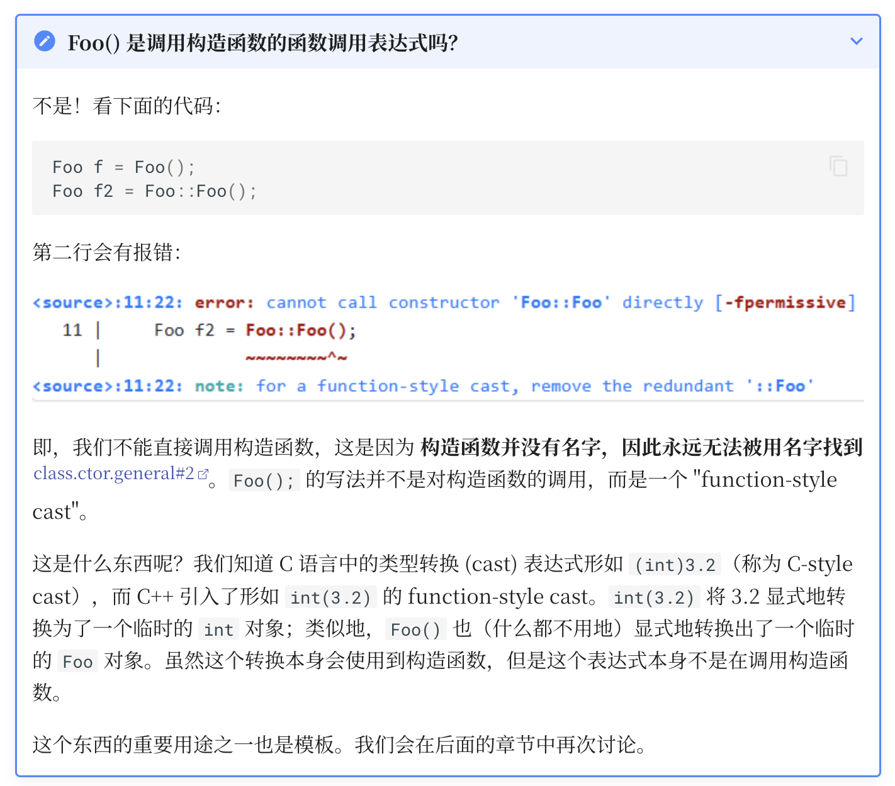
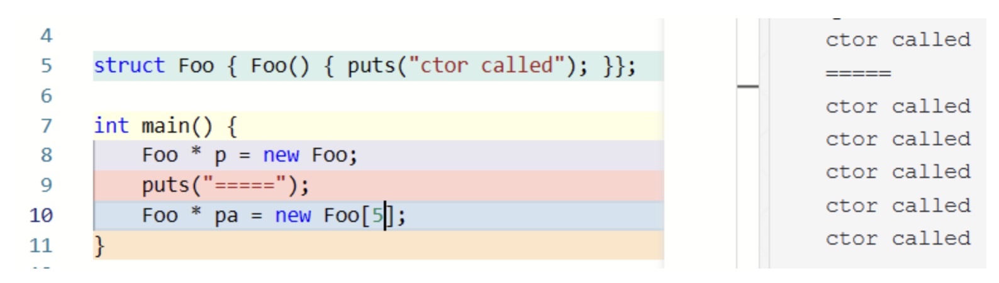
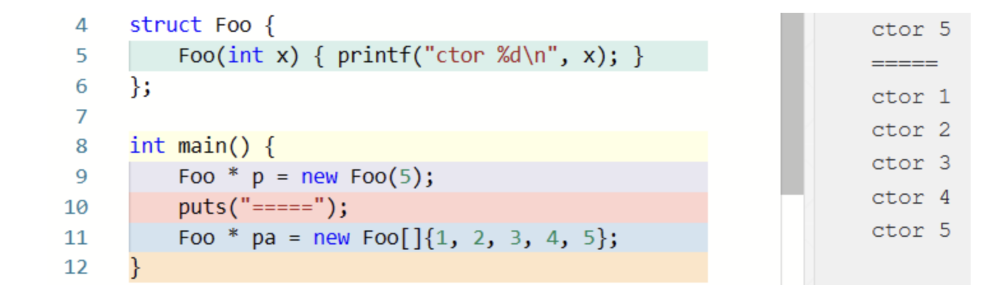
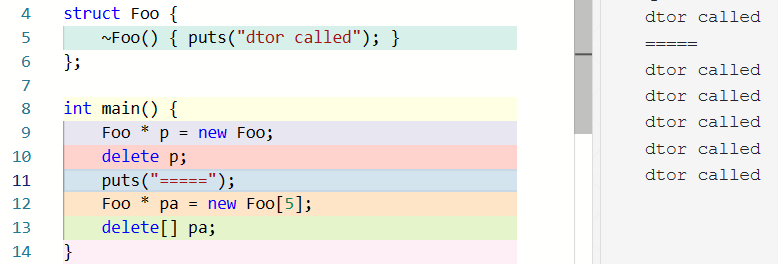
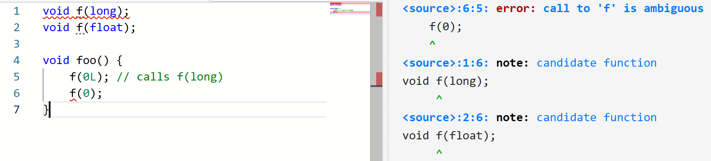

# 类：定义、成员、构造、析构

## 类的定义

在 C++ 中，用类来定义变量时，不必像 C 语言那样带有 `struct` 关键字。即，如果有 `class Foo` 或者 `struct Bar` 的定义，那么 `Foo x;`, `class Foo x;`, `Bar b;`, `struct Bar b;` 都是合法的声明语句，C++ 希望用户能够像用内置类型一样地使用自定义类型。

具体的，类的定义如下：


- opt 说明某个元素是可选择的，例如，class-specifier: class-head { $\text{member-specification}_\text{opt}$ } 说明 class-specifier 中可以没有 member-specification，例如 `class Foo {}` 或者 `class A : public B {}` 之类的。
- 这里的 class-name 是一个 identifier，例如上面的 `Foo` 和 `A`。
- 这里的 class-key 决定了类是否是一个 union，以及默认情况下成员是 public 的还是 private 的。union 一次最多保存一个数据成员的值。也就是说，在 C++ 中，struct, class, union 都是类。但是在本节的后续讨论中，我们暂时只讨论 struct 和 class。
- 这里的 base-clause 定义为 `base-clause : base-specifier-list`，是用来处理派生类的。例如 1 中的 `: public B`。
- 这里的 nested-name-specifier 是 `::` 或者 `Foo::` 之类的东西：

```c++
class Inner { };

class Outer {
public:
    class Inner { int x; };
    Outer::Inner i;
    Inner i2;
    ::Inner i3;     // global Inner
    struct A;       // declares struct Outer::A
};

struct Outer::A {}; // defines struct Outer::A

int main() {
    Outer o;
    Inner i4;
    Outer::Inner i5;
    printf("%d %d %d %d %d", sizeof o.i, sizeof o.i2, sizeof o.i3, sizeof i4, sizeof i5);
    // Possible output: 4 4 1 1 4
    return 0;
}
```

## 声明和定义

声明将名字引入或重新引入到程序中。定义是声明的一种，指的是那些引入的名字对应的实体足以被使用的声明。

有关**重新引入**的例子：

```c++
extern int i;
extern int i;

int f(int);
int f(int x);
```

上面的例子是合法的。它们只是 `i` 和 `f` 的声明而非定义。

而下面的语句都是定义：

```c++
int a;                          // defines a
extern const int c = 1;         // defines c
int f(int x) { return x+a; }    // defines f and defines x
struct S { int a; int b; };     // defines S, S::a, and S::b
enum { up, down };              // defines up and down
S anS;                          // defines anS
```

### 类的成员

member-specification 说明了类的成员：


其中 member-declaration 是成员的声明，而 access-specifier 是 `private`, `public`, `protected` 之一。成员可以包括成员变量、成员函数，也可以（嵌套的）类、枚举等，如本文前面代码中的 `Outer::Inner`，还可以包括声明类型的别名（如 `typedef` 和 `using`）等。

C++11 引入了 `using` 来声明类型别名，它的用途和 `typedef` 类似，如 `typedef struct arraylist_* arraylist;` 可以写成 `using arraylist = struct arraylist_ *;`。

类型别名的声明也可以是类的成员，其作用域是类的作用域，同样受 access-specifier 的影响。例如：

```c++
struct Foo {
    using elem = int;
    elem x;     // OK, x has type int
    elem add(elem v) { x += v; return x; }
private:
    using type = char;
    type c;     // OK, c has type char
};

// elem y;      // Error: unknown type name 'elem'
Foo::elem z;    // OK, z has type int
// Foo::type c; // Error: 'type' is a private member of 'Foo'   
```

类的成员函数可以在类内直接给出定义，也可以在类内只声明，在类外给出定义；这不影响成员函数的 access-specifier：

```c++
class Foo {
    int x = 0;
    void foo(int v) { x += v; }
    void bar(int v);
};

void Foo::bar(int v) { x += v; }

int main() {
    Foo f;
    f.bar(1);  // Error: 'bar' is a private member of 'Foo'
}
```

另外，和全局函数一样，类的成员函数也可以只有声明没有定义，只要这个函数没有被使用。

### `this` 指针

C++ 早期会被编译成 C 语言，然后再编译成汇编，那么我们考虑 C++ 和 C 语言最显著的区别——类中定义函数，这个函数访问了调用这个函数的对象（calling object），我们只定义了一次函数，但是有很多类，我们怎么在这个函数中，知道这次的 calling object 是什么呢？

在 C++ 中，每个成员函数都会被视为有一个 implicit object parameter，在成员函数的函数体中，`this` 表达式的值即是 implicit object parameter 即 calling object 的地址。

在成员函数的函数体中，访问任何成员时都会被自动添加 `this->`，例如 `void Foo::bar(int v) { x += v; }` 中的 `x += v;` 实际是 `this->x += v;`。

看一下汇编：

C++ 代码：

```c++
class Foo {
public:
    void f() { x += 2; }  // 实际是 this->x += 2
};
```

汇编代码：

```assembly
; 将调用对象的地址（this）存入 rdi 寄存器
mov QWORD PTR [rbp-8], rdi  ; 保存 this 指针到栈
mov rax, QWORD PTR [rbp-8]  ; 加载 this 指针到 rax
mov rdi, rax                ; 将 this 作为参数传递
call Foo::f()               ; 调用成员函数
```

### `inline` 函数

众所周知，函数调用是有开销的，比如传递参数和获取返回值。

C++ 的设计哲学决定了，不应当因为封装性而带来性能的额外的性能开销。早在 C with Classes 设计之初，函数调用的问题就已经被**内联替换（inline substitution）** 解决了。

内联替换即在函数调用的地方将函数展开，不用再传参和传返回值了。

那么，什么样的函数会被内联呢？只有那些函数体写在类的定义中的成员函数才会被内联。而在后来的 C++ 中，`inline` 关键字被引入；它用在函数声明中，例如 `inline int foo(int x) { return add5(x); }`。它向编译器表明一个建议：这里应该优先考虑使用内联替换而非通常的函数调用，当然，编译器通常会忽略这种建议。

但是，如果被内联的函数非常大，则会导致生成的目标代码很大，这会带来内存紧张或者局部性问题；这也可能会对性能产生一定影响。

## 构造函数

构造函数 (constructor) 是一种特殊的成员函数，用于初始化该类的对象。构造函数 constructor 也时常被简写为 ctor 或者 c'tor 等。

构造函数的意义之一是：使程序员能够建立起某种保证，其他成员函数都能依赖这个保证。

```c++
class Container {
    elem* val;
    // ...
public:
    Container() {
        val = nullptr;
    }
    // ...
};
```

在上面的程序中，第 5 行的 `Container()` 是构造函数。它和其他成员函数的区别是，它不写返回值类型，而且它直接使用类的名字。

第 6 行的 `val = nullptr;` 就是前面提到的「保证」，即 `val` 的值要么是 `nullptr`，要么是其他成员函数赋的值，而不会是个随机的值。

这样，就可以使用 `Container c = Container();` 构造一个对象了，其中`Container();` 会返回一个构造出的无名对象。为了代码更加简洁紧凑，C++ 允许更加简洁的写法：`Container c;`。

注意，由于定义一个对象时需要用到构造函数，因此如果要用的构造函数是 `private` 的，对象就无法被构造。



和普通的函数一样，构造函数是可以有参数的：

```cpp
class Container {
    elem* val;
    // ...
public:
    Container(unsigned size) {
        val = (elem*)malloc(sizeof(elem) * size);
        // ...
    }
    // ...
};
```

这样，就可以使用 `Container c2 = Container(64);` 构造一个自定义大小的容器了。

同样地，C++ 允许更加简洁的写法：`Container c2(64);`。

### 动态分配内存

构造函数存在的意义是给类中的每个对象提供一定的“保证”，而 C++ 通过确保每个对象都执行过构造函数来提供这一保证。在 C 语言中，我们通过 `malloc` 来新定义一个指针指向的类：`Container *p = (Container *)malloc(sizeof(Container));`。那么如果我们在 C++ 中这么写，会发生什么呢？

事实上，这确实分配了 `sizeof(Container)` 那么大的空间，但是确实也没有调用构造函数。因此，C++ 引入了新的用于创建动态对象的操作符 `new` 以及对应的用来回收的 `delete`。

`new` 表达式可以用来创建对象或者数组：`int * p1 = new int; int * pa = new int[n];`。

如果 `new` 的对象是定义的类，那么构造函数会被调用：



`new` 表达式也可以包含初始化器，但是只能是 `( something )` 或者 `{ something }` 的形式，不能是 `= something` 的形式：



`new` 表达式干的事情是申请内存 + 调用构造函数，返回一个指针；而 `delete` 表达式干的事情是调用析构函数 + 释放内存。`new` 表达式是 **唯一** 的用来创建动态生命周期对象的方式（因为 `malloc` 只是开辟内存，并不创建对象。对象是「a region of storage with **associated semantics**」）。

`delete` 会调用类对象的析构函数：



## 函数默认参数与函数重载

### 默认参数

加入我们希望用户既可以给定大小，也能够在不知道要开多大的情况下使用一个默认大小：

```c
void point(int x = 3, int y = 4);

point(1, 2); // calls point(1, 2)
point(1);    // calls point(1, 4)
point();     // calls point(3, 4)
```

### 函数重载

那么，假如我希望根据是否传入某个参数来选择不同的构造函数，怎么办呢？——直接在类里面构造不同的构造函数即可：

```cpp
class Container {
    elem* val;
    // ...
public:
    Container() { val = nullptr; }
    Container(unsigned size) {
        val = (elem*)malloc(sizeof(elem) * size);
    }
    Container(unsigned size, elem initVal) {
        val = (elem*)malloc(sizeof(elem) * size);
        for (unsigned i = 0; i < size; i++) {    
            val[i] = initVal;
        }
    }
};
```

事实上，不仅是函数支持重载，其他的成员函数也支持重载。

如果一个名字引用多个函数，则称它是 overloaded 的。当使用这样的名字的时候，编译器用来决定使用哪个；这个过程称为 **重载解析 (overload resolution)**。简单来说，重载解析首先收集这个名字能找到的函数形成候选函数集 (candidate functions)，然后检查参数列表来形成可行函数集 (viable functions)，然后在可行函数集中按照一定的规则比较这些函数，如果 **恰好** 有一个函数 (best viable function) 优于其他所有函数，则重载解析成功并调用此函数；否则编译失败。



在第二个 $f(0)$ 中，`long` 和 `float` 都需要转换，没有一个优于另一个，所以编译失败。
