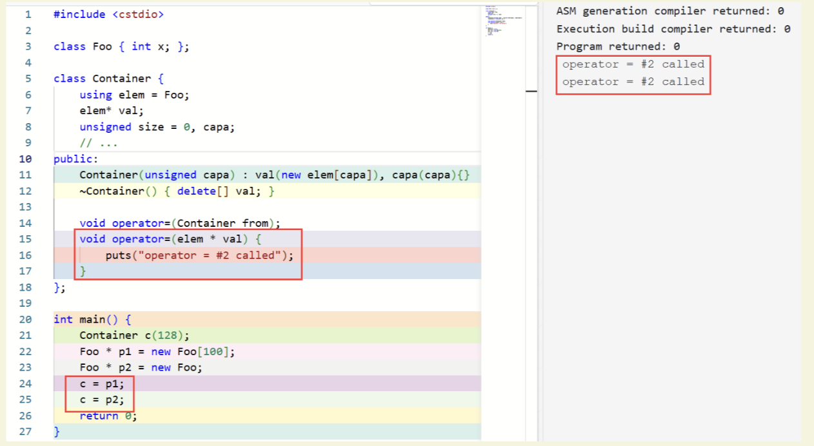
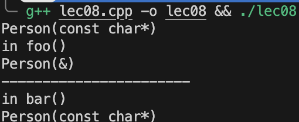
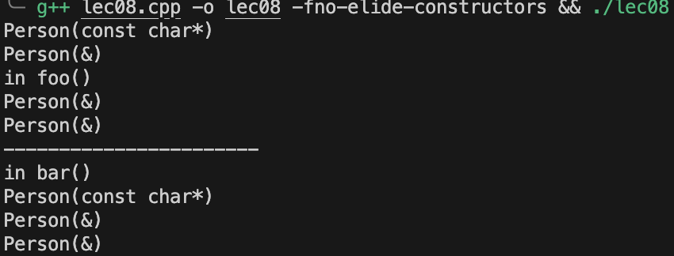

# 类：拷贝赋值、运算符重载与引用

## 拷贝赋值

如果我们创造了一个容器类：

```cpp
class Container {
    elem* val;
};
```

此时我们执行 `c1 = c2` 时，两个容器指向了同一块内存，`c1` 原先指向的内存并没有被释放，而 `c1` 和 `c2` 只是指向了同一块内存。

为此，我们通常会选择重载拷贝赋值运算符。一种常见的实现方式是利用传值方式隐式调用拷贝构造函数：

```cpp
#include <utility> // For std::swap

template <typename Elem>
class Container {
    Elem* val;
    unsigned size = 0, capa;
    // ...
public:
    Container(unsigned capa) : val(new Elem[capa]), capa(capa) {}

    ~Container() { delete[] val; }

    // Copy constructor
    Container(const Container& other) : val(new Elem[other.capa]), size(other.size), capa(other.capa) {
        for (unsigned i = 0; i < size; ++i) {
            val[i] = other.val[i];
        }
    }

    friend void swap(Container& first, Container& second) noexcept {
        using std::swap;
        swap(first.val, second.val);
        swap(first.size, second.size);
        swap(first.capa, second.capa);
    }

    // Copy assignment operator using copy-and-swap idiom
    Container& operator=(Container other) {
        swap(*this, other);
        return *this;
    }
};
```



### 规范的拷贝赋值运算符实现

一个规范的拷贝赋值运算符一般写成如下形式：

```cpp
Container& operator=(const Container& from) {
    if (this == &from) // 避免自赋值
        return *this;

    if (from.capa != capa) {
        delete[] val;
        val = new elem[from.capa];
    }
    for (unsigned i = 0; i < from.size; i++) {
        val[i] = from.val[i];
    }
    size = from.size;
    capa = from.capa;
    return *this;
}
```

**为什么参数类型是 `const class-name&`**

- 这样可以防止不必要的拷贝，提高效率。
- 允许接受临时对象。
- 保证不会修改被赋值对象。

**为什么返回 `class-name&`（即返回 `*this`）**

- 赋值运算符的返回值是左值引用，可以支持链式赋值：
    ```cpp
    a = b = 1; // 等价于 b = 1; a = b;
    // 如果 operator= 返回 *this，就可以实现 c1 = c2 = c3; 这样的操作
    ```
- 这是 C/C++ 赋值运算符右结合（right-to-left group）的语法要求。

## 运算符重载

在 C++ 中，如果赋值运算符（operator=）在当前作用域不可见（比如被声明为 private 或被 delete），那么像 `a = b;` 这样的赋值表达式就是非法的。

- 如果 operator= 是 private 的，则只能在类的成员函数中使用，类外无法访问。
- 如果 operator= 被 delete，则无论在何处都无法使用。

例如：

```cpp
class Foo {
    void operator=(Foo){} // private operator=
    void foo() {
        Foo a, b;
        a = b; // OK, private function available here
    }
};

struct Bar {
    void operator=(Bar) = delete; // deleted operator=
    void foo() {
        Bar c, d;
        c = d; // error: use of deleted function
                // 'void Bar::operator=(Bar)'
    }
};

void foo() {
    Foo a, b;
    a = b; // error: 'void Foo::operator=(Foo)' is private within this context

    Bar c, d;
    c = d; // error: use of deleted function 'void Bar::operator=(Bar)'
}
```

如上例所示，只有在 operator= 可见且未被 delete 时，赋值表达式才是合法的。

在 class 内进行重载时，传入的参数指代的是右值。

### 友元

C++ 允许一个类的定义中给一个外部的函数「授予」访问其 private 成员的权限，方式是将对应的函数在该类的定义中将对应的函数声明为一个友元 (friend)。

一个常见的用途就是对称的运算符重载，例如我们希望 `2 * matrix` 和 `matrix * 2` 都能够成立。如果将 `operator*` 作为成员函数，它只能够处理 `matrix * 2` 的情况。为了处理 `2 * matrix`，我们需要一个非成员函数，并将其声明为友元，以访问 `Matrix` 的私有成员。

```cpp
const int M = 100;
class Matrix {
    int data[M][M];
public:
    // ...
    friend Matrix operator*(int x, const Matrix& mat); // Designates a function
                                                      // as friend of this class
    // It would be good practice to also define the other version
    // friend Matrix operator*(const Matrix& mat, int x);
};

Matrix operator*(int x, const Matrix& mat) {
    Matrix tmp = mat; // copy mat
    for (int i = 0; i < M; i++) {
        for (int j = 0; j < M; j++) {
            tmp.data[i][j] *= x; // can access private member
        }
    }
    return tmp;
}
```

### 一元运算符重载

C++ 支持对大多数运算符进行重载，其中包括一元运算符（即只作用于一个操作数的运算符），如正负号（+，-）、逻辑非（!）、按位取反（~）、自增（++）、自减（--）等。

#### 一元运算符的重载方式

一元运算符可以通过成员函数或友元（非成员）函数进行重载：

- **成员函数重载**：形式为 `Type operator@();`，其中 `@` 是运算符符号。例如：
  ```cpp
  class Number {
  public:
      Number operator-() const {
          return Number(-value);
      }
  private:
      int value;
  };
  ```
  这样，`-x` 实际上会被编译为 `x.operator-()`。

- **非成员（友元）函数重载**：形式为 `Type operator@(const Type&);`，例如：
  ```cpp
  class Number {
      friend Number operator-(const Number& n);
      // ...
  };
  Number operator-(const Number& n) {
      return Number(-n.value);
  }
  ```
  这样，`-x` 会被编译为 `operator-(x)`。

#### 编译器底层逻辑

- 当你写 `@x`（如 `-x`、`!x`、`++x`），编译器会优先查找成员函数 `x.operator@()`，如果没有，再查找全局的 `operator@(x)`。
- 对于成员函数，操作数 `x` 是调用对象（即 `this` 指针）；对于非成员函数，操作数 `x` 作为参数传递。

#### 前置与后置自增/自减的区别

- **前置**（如 `++x`）：重载函数签名为 `Type& operator++();`
- **后置**（如 `x++`）：重载函数签名为 `Type operator++(int);`，其中 `int` 只是用来区分前置和后置，调用时不会传递实际参数。

示例：
```cpp
class Counter {
    int value;
public:
    // 前置++
    Counter& operator++() {
        ++value;
        return *this;
    }
    // 后置++
    Counter operator++(int) {
        Counter tmp = *this;
        ++value;
        return tmp;
    }
};
```

- `++x` 会调用 `operator++()`，先自增再返回自身引用。
- `x++` 会调用 `operator++(int)`，先保存原值，后自增，最后返回原值的副本。

### 运算符重载的限制

有些运算符在 C++ 中是**不能被重载**的，包括：

- `::`（作用域解析符，scope resolution）
- `.`（成员访问，member access）
- `.*`（通过指针访问成员，member access through pointer to member）
- `?:`（三目条件运算符，ternary conditional）

这些运算符属于语言的基础语法结构，编译器需要直接识别和处理，无法通过重载改变其行为。

此外，以下运算符虽然可以重载，但**重载时必须是成员函数**：

- `=`（赋值运算符，assignment）
- `()`（函数调用运算符，function call）
- `[]`（下标运算符，subscript）
- `->`（成员访问运算符，member access）

这是因为这些运算符的语义与对象的内部状态密切相关，只有类的成员函数才能正确访问和操作对象的私有成员。

#### 一个例子

```cpp
#include <iostream>
#include <vector>
using namespace std;

int main(){
    vector<int> v {1, 3, 5, 7, 9};

    for(int& x : v){
        x *= 3;
    }

    for(int& x : v){
        x *= 5;
    }

    for(int& x : v){
        x = x * 2 + 1;
    }

    for(int& x : v){
        cout << x << " ";
    }
    cout << endl;
    return 0;
}
```

但是我们希望将这些函数统一化，我们可以首先把 for 循环进行封装：

```cpp
#include <iostream>
#include <vector>
#include <functional>
using namespace std;

void transform(vector<int>& v, function<int(int)> f){
    for(int& x : v){
        x = f(x);
    }
}

int main(){
    vector<int> v {1, 3, 5, 7, 9};

    transform(v, [](int x){return x * 3;});
    transform(v, [](int x){return x * 5;});
    transform(v, [](int x){return x * 2 + 1;});

    for(int& x : v){
        cout << x << " ";
    }
    cout << endl;
    return 0;
}
```

其中我们传递了一个函数指针，且在 main 函数中用了 lambda 表达式简化函数的定义（即我们不用单独去分别定义三个函数了，结果是一样的

然后我们希望把函数的功能变得更多元一些，我们可以构造类和重载操作符来实现乘任意数和一次线性变换的功能：

```cpp
#include <iostream>
#include <vector>
#include <functional>
using namespace std;

void transform(vector<int>& v, function<int(int)> f){
    for(int& x : v){
        x = f(x);
    }
}

class mul_by{
public:
    mul_by(int n): n_(n){};
    int operator()(int x){
        return x * n_;
    }
private:
    int n_;
};

class line{
public:
    line(int a, int b): a_(a), b_(b){};
    int operator()(int x){
        return a_ * x + b_;
    }
private:
    int a_;
    int b_;
};

int main(){
    vector<int> v {1, 3, 5, 7, 9};

    transform(v, mul_by(3));
    transform(v, mul_by(5));
    transform(v, line(2, 1));

    for(int& x : v){
        cout << x << " ";
    }
    cout << endl;
    return 0;
}
```

## 引用

### 引用作为返回值

引用可以作为函数的返回值。看下面的例子：

```cpp
class Container {
    elem* val;
    // ...
public:
    elem& operator[](unsigned index) {
        return val[index];
    }
    // ...
};
```

通过返回引用值，我们相当于返回了 Container 内部成员的别名，可以直接修改它。

这样我们可以通过 `c[i]` 的方式访问容器中的值，如读取 `x = c[i]` 或者写入 `c[i] = x`。
这使得我们不再需要写 `c.getVal()[i] = x` 之类的冗余代码，代码更加简洁直观。

#### 注意避免悬垂引用（dangling reference）

返回引用时要特别注意，**不能返回局部变量的引用**。否则会产生悬垂引用，导致未定义行为。例如：

```cpp
int& foo() {
    int tmp = 10;
    // ...
    return tmp;
}
```

这里 `tmp` 是局部变量，在函数结束时就会被销毁；但函数却返回了一个引用这个已经不存在的变量的引用。这就是悬垂引用（dangling reference），会导致 undefined behavior。

### const int * 和 int const *

`const int *` 和 `int const *` 都表示"指向一个不可变的 int 的指针"，即指针本身可以修改，但指向的 int 变量是只读的。

例如：

```cpp
const int i = 1;
int j = 3;

int * s = &i;        // error: invalid conversion from 'const int *' to 'int *'

const int * p = &i;  // OK
const int * q = &j;  // OK, assign 'int *' to 'const int *' is valid

i = 4;    // error: assignment of read-only variable 'i'
*p = 4;   // error: assignment of read-only location '*p'
j = 4;    // OK
*q = 4;   // error: assignment of read-only location '*q'

p = q;    // OK, the pointer itself is not constant
const int * r; // OK, non-const variable can be defined without initializer

int * s = q; // error: invalid conversion from 'const int *' to 'int *'
```

- `const int *p` 或 `int const *p`：不能通过 `*p` 修改指向的值，但可以让 p 指向别的 int。
- 不能用 `const int *` 赋值给 `int *`，因为这样会绕过 const 限制。

这种写法常用于函数参数，表示"指针指向的数据不会被修改"，有助于代码安全和可读性。

同时需要注意 `const int const` 是不存在的，并且引用除非是 `extern` 的，否则必须初始化。

### 临时对象与 const 引用的生命周期延长

C++ 规定：可以将一个临时对象绑定给一个 `const` 引用，这时临时对象的生命周期会被自动延长，以匹配这个 `const` 引用的生命周期。例如：

```cpp
void foo() {
    const Matrix& m = m1 - m2; // temporary `Matrix` has same lifetime as `m`
    // ...
    // at the end of this function block, the lifetime of `m` ends,
    // so the lifetime of temporary `Matrix` ends, d'tor called.
}
```

这样，`m1 - m2` 产生的临时对象会一直存活到 `m` 作用域结束，保证引用始终有效。这是 C++ 为了安全和高效支持临时对象引用而设计的机制。

需要注意的是，在 BS Release 2.0 下，临时对象不允许被绑定给 non-const 引用。

### 引用与重载解析

**int 和 int& 作为重载参数时的二义性**

将一个 int 类型的变量传递给 int 类型的参数和 int& 类型的参数时，二者的匹配优先级是一样的，会导致重载解析出现二义性。

```cpp
void f(int x) { puts("int"); }      // Overload #1
void f(int& r) { puts("int &"); }   // Overload #2

int main() {
    int x = 1;
    f(1); // OK, only #1 valid
    f(x); // Error: ambiguous overload
}
```

- `f(1)` 只能匹配 `void f(int)`，因为字面量不能绑定到非常量引用。
- `f(x)` 同时可以匹配 `void f(int)` 和 `void f(int&)`，编译器无法决定调用哪个，导致二义性（ambiguous overload）。

**int 和 const int& 作为重载参数时的二义性**

将 int 类型的变量传递给 int 类型的参数和 const int& 类型的参数时，二者的匹配优先级也是一样的，也会导致重载解析的二义性。

```cpp
void g(int x) { puts("int"); }
void g(const int& r) { puts("const int &"); }

int main() {
    int x = 1;
    const int y = 2;
    g(1); // Error: ambiguous overload
    g(x); // Error: ambiguous overload
    g(y); // Error: ambiguous overload
}
```

- 无论是字面量、普通 int 变量还是 const int 变量，既可以传给 `int` 也可以传给 `const int&`，编译器无法决定调用哪个重载，导致二义性（ambiguous overload）。

**int& 和 const int& 作为重载参数时的优先级**

如果有两个重载，它们在某个参数上的唯一区别是 int& 和 const int&，而 int 类型的变量绑定这两种参数都是可行的，此时 int& 的优先级更高。

```cpp
void h(int& r) { puts("int &"); }
void h(const int& r) { puts("const int &"); }

int main() {
    int x = 1;
    const int y = 2;
    h(1); // OK, only #2 valid
    h(x); // OK, #1 called as x -> 'int&' is better than x -> 'const int&'
    h(y); // OK, only #2 valid
}
```

- 字面量和 const 变量只能绑定到 `const int&`，只能调用 #2。
- 普通 int 变量既能绑定到 `int&` 也能绑定到 `const int&`，但 `int&` 更优先。

### 类的引用成员和 const 成员的初始化

引用和 const 变量都必须在定义时给出初始化值，不能在构造函数体内赋值。如果一个类中有引用成员或 const 成员，必须通过 member initializer list（成员初始化列表）或 default member initializer（默认成员初始化）来初始化。

例如：

```cpp
int global = 10;

class Foo {
    const int x = 4;      // OK，默认成员初始化器
    const int y;          // 必须通过成员初始化列表初始化
    int& rz = global;     // OK，默认成员初始化器
    int& rw;              // 必须通过成员初始化列表初始化
public:
    Foo(int m, int& n) : y(m), rw(n) {}           // OK
    Foo() : y(0), rw(global) {}                   // OK
    Foo() : y(0) {}                              // Error: uninitialized reference member in 'int&'
    Foo() : rw(global) {}                        // Error: uninitialized const member in 'const int'
};
```

- const 成员和引用成员如果没有在声明时初始化，**必须**在构造函数的成员初始化列表中初始化。
- 如果没有初始化，编译器会报错。
- 不能在构造函数体内为 const 或引用成员赋值。

这种规则保证了 const 和引用成员的只读性和引用的绑定语义。

## const 成员函数

在成员函数声明和定义后加上 const 关键字，表示该函数不会修改对象的状态：

```cpp
class Example {
    int value;
    void foo(){}
public:
    int getValue() const { return value; } // 正确：只读访问
    void setValue(int v) { value = v; }    // 非 const 函数可以修改
    void foo2() const { foo(); } // 不合法，因为 foo 不是 const 函数
};

//--------------------------------

class Cache {
    mutable int cacheCount; // 即使在 const 函数中也可修改
public:
    void updateCache() const { cacheCount++; } // 合法
};

//--------------------------------

struct Foo {
    void foo() { cout << 1 << endl; }
    void foo() const { cout << 2 << endl; }
};

int main() {
    Foo f;
    const Foo cf;
    f.foo();    // #1 called, as Foo* fits Foo* best
    cf.foo();   // #2 called, as const Foo* can only fit const Foo*
}
```

从底层的实现来讲，声明为 const 的成员函数中，this 的类型是 const Complex *；而如果没有声明为 const，则 this 的类型是 Complex *。

```cpp
struct Foo {
    string toString();
};

void bar(Foo & a, const Foo & b) {
    a.toString();   // OK
    b.toString();   // Error: 'this' argument to member function 'toString' 
                    // has type 'const Foo', but function is not marked const
}
```

我们要求 b 不能更改，但是函数 toString() 没有保证自己不会修改 *this 的值.

## Static

**static 成员变量的基本概念**

- static 成员变量属于类本身，而不是类的某个对象。所有对象共享同一个 static 成员变量。
- 在类的每个实例中，static 成员不会重复存在。例如：

  ```cpp
  struct User {
      static int tot;
      int id;
      User() : id(tot++) {}
  };
  int User::tot = 0;
  ```

  每个 User 实例有自己的 id，但所有 User 实例共享 tot。

**static 成员的访问方式**

- 推荐通过类名访问：`User::tot`
- 也可以通过对象访问：`user.tot`，但本质上还是访问同一个静态成员
- static 成员同样受 access specifier（如 public/private）的影响

**static 成员的初始化**

- static 成员变量**只能在类外初始化**，不能在构造函数、成员初始化列表或类内（除特殊情况外）初始化：

  ```cpp
  class Foo {
      static int a;
      static int b;
  };
  int Foo::a = 1;
  int Foo::b;
  ```

- **错误示例**（不能用成员初始化列表或 default member initializer 初始化 static 成员）：

  ```cpp
  class Foo {
      static int a = 1;    // 错误
      static int b;
      Foo() : b(2) {}      // 错误
  };
  ```

**const static 整型成员的特例**

- 如果 static 成员是 const 且为整型（如 int、char、bool），可以在类内直接初始化：

  ```cpp
  struct Foo {
      const static int i = 1; // OK
  };
  int main() {
      cout << Foo::i << endl;
  }
  ```

**static 成员函数**

- static 成员函数不依赖于具体对象，可以通过类名直接调用。
- static 成员函数**不能访问非静态成员变量和成员函数**，因为它没有 this 指针。

  ```cpp
  class Example {
      static int count;
  public:
      static void inc() { count++; }
  };
  ```

## Return Value Optimization

```cpp
#include <cstring>
#include <string>
#include <iostream>
using namespace std;

struct Person {
    string name;
    Person(const char* s) : name(s) {
        cout << "Person(const char*)" << endl;
    }
    Person(const Person& other) {
        cout << "Person(&)" << endl;
    }
};

Person foo(Person p){
    cout << "in foo()" << endl;
    return p;
}

Person bar(const char *s) {
    cout << "in bar()" << endl;
    return Person(s);
}

int main() {
    Person p1 = foo("Trump");
    cout << "-----------------------" << endl;
    Person p2 = bar("Biden");
}
```



这是因为我们在 p1 的构造中直接传的是字符串，这并没有调用拷贝函数，但是在 return p 当中就调用拷贝函数了，而在 bar 函数中 Person(s) 会直接在 p2 的内存地址上构造，无需中间临时对象，因此不会触发拷贝构造函数

这是因为在 C++ 中有一个返回值优化（Return Value Optimization，RVO）机制，它允许编译器在函数返回时直接在调用者的内存空间中构造对象，而不是先在临时对象中构造再拷贝到调用者的内存空间。这种优化可以避免不必要的拷贝，提高性能，我们添加选项 -fno-elide-constructors 可以关闭这个优化：



## Type Conversion

用户定义的类型转换：

- 转换运算符用于将某个类的一个对象转换至另一个类的对象或内建类型
- 编译器会使用单参数的构造函数，或者隐式的类型转换运算符来执行隐式类型转换
- 我们可以用 explicit 关键字阻止隐式的类型转换：

```cpp
class PathName {
    string name;
public:
    explicit PathName(const string&);
    ~ PathName();
};
...
string abc("abc");
PathName xyz(abc); // OK!
xyz = abc; // error!
```

运算符转换：

- 函数会被自动调用
- 返回类型和函数名相同

```cpp
class Rational {
public:
    operator double() const; // Rational to double
}
Rational::operator double() const {
    return numerator_/(double)denominator_;
}
Rational r(1,3); double d = 1.3 * r; // r=>double
```