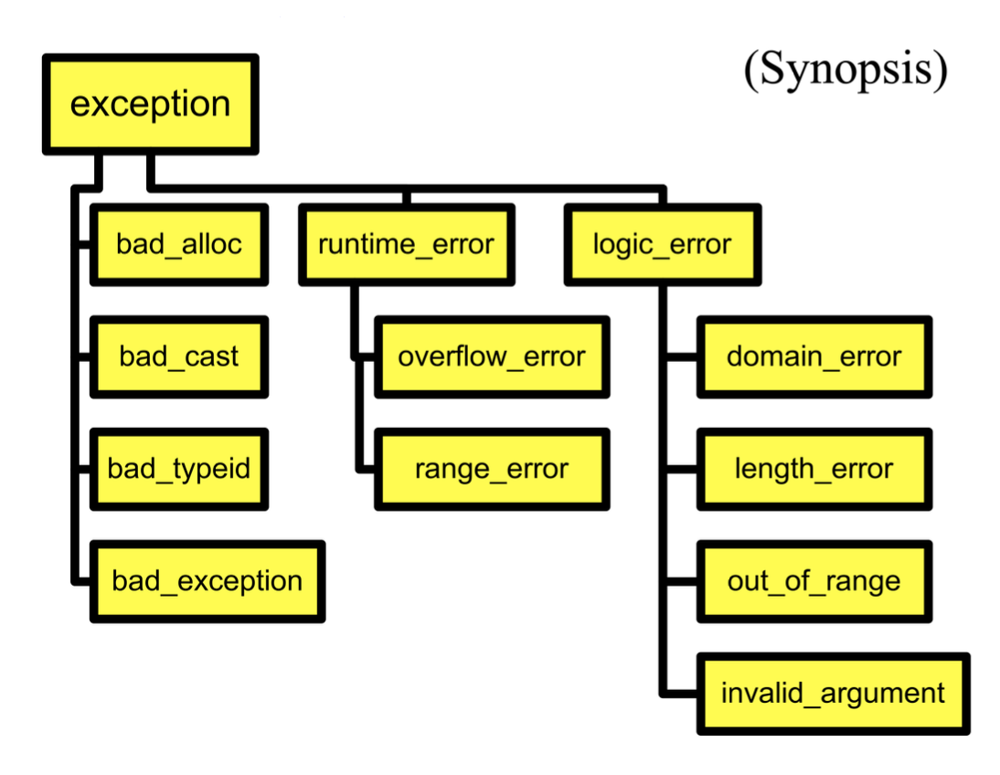

# Exception

> 基本参考 [BruceJin's Notebook](https://brucejqs.github.io/MyNotebook/blog/Computer%20Science/OOP/Chapter%2010/)

## Exceptions

下面的代码能够处理运行代码时出现的各种异常，包括找不到文件，文件虽然存在但是打不开（没有权限、被别的进程打开），文件大小判断失败（可能是一个串口，不是磁盘上的文件，串口是没有结束的）：

```cpp
try {
    open the file;
    determine its size;
    allocate that much memory;
    read the file into memory;
    close the file;
} catch (fileOpenFailed) {
    doSomething;
} catch (sizeDeterminationFailed) {
    doSomething;
} catch (memoryAllocationFailed) {
    doSomething;
} catch (readFailed) {
    doSomething;
} catch (fileCloseFailed) {
    doSomething;
}
```

### Throw

我们可以使用 throw 关键字来抛出异常，例如对于数组越界：

```cpp
template <class T>
T& Vector<T>::operator[](int indx) {
    if (indx < 0 || indx >= m_size) {
        // throw is a keyword
        // exception is raised at this point
        throw <<something>>;
    }
    return m_elements[indx];
}
```

### Try-Catch

| 场景 | 正常运行（无 try-catch） | try-catch 块 |
|------|------------------------|-------------|
| 无错误时 | 顺序执行代码 | 顺序执行 try 块内代码 |
| 发生错误时 | 直接终止程序（或未定义行为） | 跳转到匹配的 catch 块，程序继续执行后续代码 |
| 函数调用栈处理 | 立即崩溃（如段错误） | 自动展开栈（Stack Unwinding），析构局部对象 |

**我们可以使用继承的方式来构造异常结构：**

```cpp
class MathErr {
...
virtual void diagnostic();
};
class OverflowErr : public MathErr { ... }
class UnderflowErr : public MathErr { ... }
class ZeroDivideErr : public MathErr { ... }

// Using handlers
try {
    // code to exercise math options
    throw UnderFlowErr();
} catch (ZeroDivideErr& e) {
    // handle zero divide case
} catch (MathErr& e) {
    // handle other math errors
} catch (...) {
    // any other exceptions
}
```

### Exceptions and new

new 在失败时不会返回 0，而会抛出一个 bad_alloc 异常。

标准库异常：

