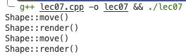

# 编程范式与 OOP 引入

## 编程范式

编程范式说明了编程语言的不同特点；分类依据包括语言的代码组织方式、运行时模型、语法风格等。我们提到的 OOP，就是按照「代码组织方式」分类的一种编程语言的特点。

那么什么是 **按代码组织方式分类** 呢？

### 非结构化编程语言

在汇编语言中，不存在诸如分支、循环之类的语言结构，他们都是用比较和跳转的指令组合来完成相应效果的。

早期的 BASIC 等语言即使存在类似含义的关键字，但是仍需要 `jmp` 或者 `goto` 等含义类似的语句来完成：

```basic
10 let a = 6
20 let b = 7
30 if a < b goto 60
40 print(a)
50 goto 70
60 print(b)
70 end
```

对比之下，C++ 就是以语句块为单位：

```c
a = 6;
b = 7;
if (a < b) {
    print(b);
} else {
    print(a);
}
```

（上面这个代码中，3~7 行是一个完整的语句）

从非结构化到结构化，我们把计算机具体的、与机器和环境高度相关的指令**抽象**成了更接近人类思维的指令，牺牲了精密的可控性，提高了通用性、易读写性和可移植性。

## Object-Oriented Programming

**OOP 是一种编程范式，强调封装、继承和多态。**

### 封装（Encapsulation）

对比 C 语言，从思想方面，我们希望将**数据**和**操纵数据**的函数更加明显地捆绑在一起；从语法上来说，我们扩展了 struct，现在 struct 不仅可以包含**成员变量**，还能包含**成员函数**：

线性表（链表实现）

```c++
struct node {
    elem* val;
    struct node* next;
};

struct linkedlist {
    struct node* llist;

    static linkedlist create();
    int size() const;
    elem* get(int index) const;
    void add(elem val);
    // ...
};
```

线性表（数组实现）

```c++
#define MAX_SIZE 1024

struct arraylist_ {
    elem* val[MAX_SIZE];
    int size;
};

struct arraylist {
    struct arraylist_* alist;

    static arraylist create();
    int size() const;
    elem* get(int index) const;
    void add(elem val);
    // ...
};
```

#### 对象和类

从编程的角度来看，**状态**可以用数据变量表示，**行为**可以用函数表示。

**类**是一种用户自定义的数据类型，程序员可以创建这种类型的变量（**对象 / 实例(instance)**），并且进行操纵。这种数据类型是状态和行为的集合，即用变量和函数来描述并且定义。这些变量和函数，是这个类的**成员**。

在 C 这种非 OOP 的语言中，用户自定义的类型只能定义状态而不能定义行为，这种思想更贴近机器实现——真正的汇编代码确实不能有同名的函数。但是 OOP 在此基础上做了进一步的抽象，让代码更加贴近人们对**类**自然的理解，机器层面的实现则交给编译器。

#### 访问控制

在 C++ 中，提供了 access-specifier 来解决"类中成员变量对外权限"的问题，包括 `public`, `private` 和 `protected` 三种，我们主要只讨论前两种。

所谓 `public`，是说这之后的成员变量和成员函数对外部可见；而 `private` 则是说这之后的成员变量和成员函数不能在类外被访问，只能在类的成员函数内访问或调用。例如：

```c
struct User {
private:
    int id, age;
    char* password;
public:
    bool checkPassword(char* pw); // check if pw == password
    void setAge(int v) {
        if (v >= 0)
            age = v;
    }
    int getAge() { return age; }
    // ...
};
```

此时，如果外部代码尝试访问 private 变量，就会被编译器拒绝，在这种情况下，private 的变量在外部只能通过 `checkPassword`, `setAge`, `getAge` 这些函数间接访问，从而让外部的访问是有限制并且经过检查的。

（在 C++ 中，struct 默认都是 public，class 默认都是 private，其余二者没有任何区别）

### 继承 & 多态（Inheritance & Polymorphism）

考虑如果我们有很多个极其相似的类，如果我们要对他们进行集体改动、集体操作怎么办？

一个很自然的想法是对于这些相似的类定义一个更加高级的类，记录那些共同的部分，然后在定义低级的类时，对高级类的成员和行为进行**继承**。

比如我们先定义一个"图形类"：

```c++
class Shape {       // 基类 Shape
private:
    void prepare()  { /* 做一些准备（例如准备画笔）*/ } 
    void finalize() { /* 做一些后续处理（例如重置画笔）*/ }
public:
    Point center;   // 共有的成员变量

    void draw() {   // 共有的成员函数
        prepare();
        do_draw();
        finalize();
    }
    virtual void do_draw() = 0; // 要求所有派生类都实现 do_draw()
};
```

基于这个图形类，我们再定义具体的 Circle 和 Rectangle：

```c++
class Circle : public Shape {   // Circle 继承 Shape
public:
    int radius;     // 独有的成员变量

    void do_draw() {
        // 画圆！
    }
};

class Rectangle : public Shape { // Rectangle 继承 Shape
public:
    int width, height; // 独有的成员函数

    void do_draw() {
        // 画长方形！
    }
};
```

在 Shape 中，虽然 `do_draw()` 是一个函数，但是在代码运行的时候，会更具调用它对象的实际类型来决定到底调用 `Circle::do_draw()` 还是 `Rectangle::do_draw()` 。这种机制就是 OOP 中的 **多态 (polymorphism)**。

同时，我们还可以选择是 public 继承还是 private 继承:

```cpp
class Base {
public:
    int publicMember;
protected:
    int protectedMember;
};

// 类A私有继承Base
class A : private Base {  
    // 在A内部：Base的public/protected成员均变为private
};

// 类B公有继承Base（完全合法，不受A的影响）
class B : public Base {  
    // 在B内部：Base的public仍为public，protected仍为protected
};
```

```cpp
#include <iostream>
using namespace std;

class Shape{
public:
    void move(){
        cout << "Shape::move()" << endl;
    }
    virtual void render(){
        cout << "Shape::render()" << endl;
    }
};

class Ellipse : public Shape{
public:
    void render(){
        cout << "Ellipse::render()" << endl;
    }
};

class Circle : public Ellipse{
public:
    void render(){
        cout << "Circle::render()" << endl;
    }
};

void foo(Shape *p){
    p->move();
    p->render();
}

int main(){
    Ellipse e;
    Circle c;
    foo(&e);
    foo(&c);
    return 0;
}
```



### Virtual Function

#### 虚函数 (Virtual Functions)

- **非虚函数**：编译器为指定类型生成静态或直接的调用，执行更快。
- **虚函数**：
    - 在派生类中能被透明地 (Transparently) 重写。
    - 对象携带一组虚函数表（vtable）。
    - 编译器检查这组虚函数，并动态调用正确的函数。
    - 如果编译器在编译时知道函数，那么就会生成静态调用。

#### 多态变量 (Polymorphic Variables)

- 对象的指针或引用变量是多态变量。
- 它们可以保存声明类型的对象，或声明类型的子类型的对象。

---

对于上面这个例子，我们在 `Shape` 类的 `render` 函数前加上 `virtual` 关键字：

```cpp
class Shape{
public:
    void move(){
        cout << "Shape::move()" << endl;
    }
    virtual void render(){
        cout << "Shape::render()" << endl;
    }
};
```

这时我们再运行程序，便会得到想要的结果：

```
Shape::move()
Ellipse::render()
Shape::move()
Circle::render()
```

**多态实现的原理：如果我们有一个子类的指针，并执行它的成员函数，它会从指针先找到类，再找到虚函数表（共享的），再找到函数的地址，然后执行函数。**

!!! Note
    当通过 基类指针/引用 调用虚函数时，C++ 会按照 从最派生类向基类 的顺序查找函数实现，具体步骤如下：

    1. 从对象的实际类型开始：
        根据指针/引用指向的 实际对象类型（动态类型），查找该类的重写实现。

    2. 沿继承链向上查找：
        如果当前类未重写该虚函数，则查找其直接基类。

    3. 重复此过程，直到找到第一个重写的实现或到达最初的基类。

    4. 最终调用：
        执行找到的第一个重写版本。若所有派生类均未重写，则调用基类的原始实现。

```cpp
#include<iostream>
using namespace std;
class Base{
protected:
    int x;
public:
    Base(int b=0): x(b) { }
    virtual void display() const {cout << x << endl;}
};
class Derived: public Base{
    int y;
public:
    Derived(int d=0): y(d) { }
    void display() {cout << x << "," << y << endl;}
};
int main()
{
  Base b(1);
  Derived d(2);
  Base *p = &d;
  b.display();
  d.display();
  p->display();
  return 0;
}
/*
1
0,2
0
*/
```

```cpp
#include<iostream>
#include<string>
using namespace std;

class Pet {
public:
    virtual string speak() const { return "pet!"; }
};
class Dog : public Pet {
public:
    string speak() const { return "dog!"; }
};
int main() {
    Dog ralph;
    Pet* p1 = &ralph;
    Pet& p2 = ralph;
    Pet p3;
    cout << p1->speak() <<endl;
    cout << p2.speak() << endl;
    cout << p3.speak() << endl;
    return 0;
}
/*
dog!
dog!
pet!
*/
```