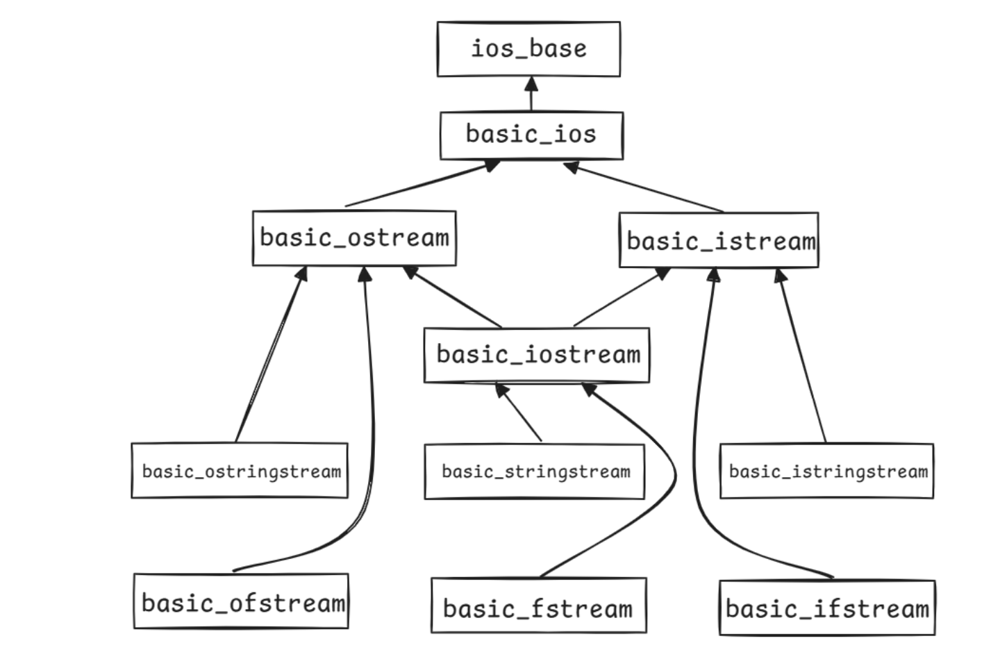

# I/O Stream

using 语句属于特定作用域，其作用范围持续到其所在块结束。

- cin：标准输入流，用于读取用户输入
- cout：标准输出流，用于输出信息（无缓冲）
- cerr：标准错误流，用于输出错误信息（无缓冲）
- clog：标准日志流，用于记录非关键事件的日志（有缓冲）



## 类层次结构解析

1. 顶层基类

- `ios_base`：所有 I/O 相关类的基类，提供基本的 I/O 状态管理、格式化控制等功能。
- `basic_ios`：继承自 `ios_base`，是 `basic_istream` 和 `basic_ostream` 的共同基类，负责流的状态管理、错误处理等。

2. 基本输入/输出流

- `basic_ostream`（输出流基类）：用于输出数据，如 `std::cout`。
- `basic_istream`（输入流基类）：用于输入数据，如 `std::cin`。
- `basic_iostream`（输入输出流）：同时支持输入和输出，继承自 `basic_istream` 和 `basic_ostream`。

3. 字符串流（处理 `std::string`）

- `basic_ostringstream`：继承自 `basic_ostream`，用于写入字符串流（`std::ostringstream`）。
- `basic_istringstream`：继承自 `basic_istream`，用于读取字符串流（`std::istringstream`）。
- `basic_stringstream`：继承自 `basic_iostream`，支持字符串的读写（`std::stringstream`）。

4. 文件流（处理文件 I/O）

- `basic_ofstream`：继承自 `basic_ostream`，用于文件写操作（`std::ofstream`）。
- `basic_ifstream`：继承自 `basic_istream`，用于文件读操作（`std::ifstream`）。
- `basic_fstream`：继承自 `basic_iostream`，用于同时读写文件（`std::fstream`）。

`std::cout` 流是 `std::ostream` 的一个实例，`std::cin` 流是 `std::istream` 的一个实例。

## 字符串流

```cpp
int main()
{
    std::string initial_quote = "Bjarne Stroustrup C makes it easy to shoot yourself in the foot";

    // 两种字符串流初始化方式
    // 1. 字符串构造函数
    std::stringstream ss(initial_quote);

    // 2. 插入字符串
    // std::stringstream ss;
    // ss << initial_quote;

    std::string first;
    std::string last;
    std::string language, extracted_quote;

    // >> 提取符按数据流顺序读取字符串的内容，
    // 以空白字符分隔（' ', '\n', '\t'）
    ss >> first >> last >> language >> extracted_quote;

    // 输出
    std::cout << first << "" << last << " said this: " << language << " " << extracted_quote << std::endl; 
}
```

`getline` 函数接口为 `istream& getline(istream& is, string& str, char delim)`

- `getline()`读取一串输入流`is`，直到读取字符 `delim` 时停止，将读到的数据存入缓冲区`str`中
- `delim` 默认为 `\n`
- `getline()` 读取的数据是会把字符 `delim` “消耗（consumes）” 掉，也会读取这个字符

## 输出流

输出流的字符在被释放（flush）到目的地之前会被存储在一个中间缓冲区内，`std::endl` 除了换行之外，还会立即执行一次 flush 操作。

输出文件流（output file streams）的类型为 `std::ofstream`，同样采用 `<<` 插入符将数据送入文件内。

`std::ofstream` 常用的几种方法有

- `is_open()`
- `open()`
- `close()`
- `fail()`

## 输入输出流的运算符重载与链式调用

### std::cin 的类型与 operator>> 重载

`std::cin` 的类型是 `std::istream`（输入流），其中对各种基本类型重载了 `operator>>`。例如：

```cpp
istream& istream::operator>>(int& value) {
    // ... extract (read) an int from the stream
    return *this;
}
istream& istream::operator>>(double& value) {
    // ... extract (read) a double from the stream
    return *this;
}
```

### 为什么 operator>> 返回 istream&

返回 `istream&`（即 `*this`）的目的是支持链式调用：

```cpp
cin >> x >> y;
// 等价于：
(cin.operator>>(x)) >> y;
// cin.operator>>(x) 返回 cin 本身
// 所以继续 cin >> y;
```

这样可以连续多次输入，语法简洁。

### std::cout 的类型与 operator<< 重载

与 cin 类似，`std::cout` 的类型是 `std::ostream`（输出流），它同样对各种基本类型重载了 `<<` 运算符。例如：

```cpp
ostream& ostream::operator<<(int value);
```

### 用户自定义类型的输入输出重载

对于自定义类型（如 Complex），可以通过重载 `operator>>` 和 `operator<<` 实现流式输入输出。通常写成友元函数：

```cpp
#include <iostream>
#include <string>
using std::istream;
using std::ostream;
using std::string;
using std::to_string;

class Complex {
private:
    double real, imaginary;
public:
    // ...
    string toString() const;
    friend istream& operator>>(istream& is, Complex& right);
};

string Complex::toString() const {
    string str = to_string(this->real);
    str += " + ";
    str += to_string(this->imaginary) + "i";
    return str;
}
```

这样就可以像内置类型一样使用 `cin >> c` 或 `cout << c` 了。

我们可以还自定义操纵符（Manipulators）：

```cpp
// skeleton for an output stream manipulator
ostream& manip(ostream& out) {
    ...
    return out;
}

ostream& tab ( ostream& out ) {
    return out << '\t';
}

cout << "Hello" << tab << "World!" << endl;

```

### 另一个例子

```cpp
int main()
{
    // 在文件 hello.txt 中创建一个新的输出文件流
    std::ofstream ofs("hello.txt");

    // 检查文件是否打开，若是则将一段字符串写进文件内
    if (ofs.is_open())
    {
        ofs << "Hello CS106L!" << '\n';
    }

    // 关闭文件
    ofs.close();
sy
    // 由于文件已关闭，以下内容不会被写入 hello.txt 中
    ofs << "this will not get written";

    // 重新打开文件
    ofs.open("hello.txt");

    // 下面的字符串又可以被写入文件内，但是会覆盖文件原来的内容
    ofs << "this will though! It's open again";

    return 0;
}
```

