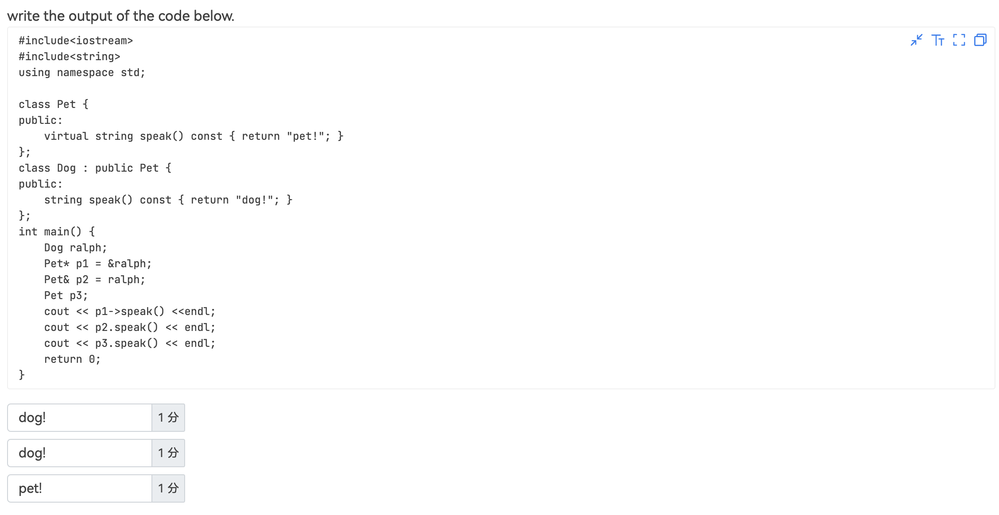

# 杂项

## 编程范式

C++ 主要支持以下编程范式：

- A. Object-oriented programming（面向对象编程）
    - C++ 直接支持类（class）、继承（inheritance）、多态（polymorphism）等OOP特性。
- B. Procedural programming（过程式编程）
    - C++ 兼容C风格的过程式编程，支持函数、结构体、指针等。
- C. Generic programming（泛型编程）
    - C++ 的模板（template）和STL（标准模板库）提供了强大的泛型编程能力。
- D. Declarative programming（声明式编程） （支持较弱）
    - 声明式编程（如SQL、函数式编程中的高阶声明）在C++中没有原生语法支持。
    - C++ 可以通过模板元编程（TMP）或Lambda表达式模拟部分声明式风格，但相比Haskell、SQL等语言，其表达能力有限。

## Overloading and Overriding

**重载：**

函数名相同，但参数列表必须不同（参数类型、数量、顺序）。

返回类型可相同也可不同。
```cpp
void print(int a);          // 重载1
void print(double a);       // 重载2
void print(int a, int b);   // 重载3
```

**重写：**

函数名、参数列表、返回类型必须完全相同。

```cpp
class Base {
public:
    virtual void show() { cout << "Base"; }
};
class Derived : public Base {
public:
    void show() override { cout << "Derived"; }  // 重写
};
```

## Enclosing Class & Base Class

外部类（Enclosing Class，也叫“外围类”）：

```cpp
class Enclosing {
    class Inner {
        // ...
    }
}
```

基类（Base Class）：

```cpp
class Base { }  // 基类（Base Class）
class Derived extends Base { }  // 子类（Derived Class）
```


## 题目整理

!!! Problem1
    
    本质上还是前三个指向同一个内存空间。

